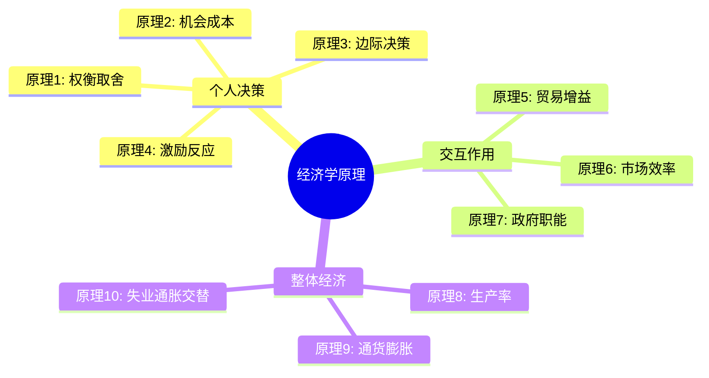
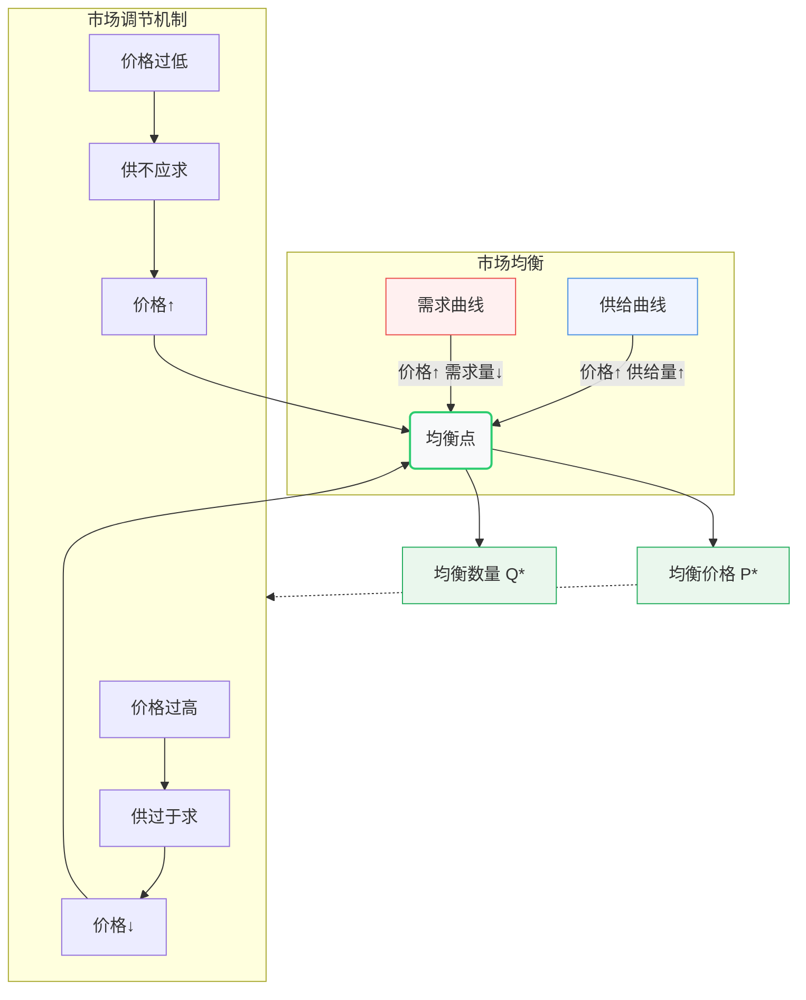
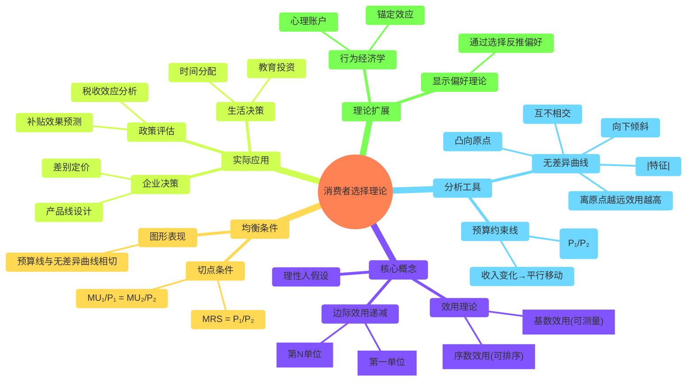

曼昆的《经济学原理》作为经济学领域的经典教材，以其清晰的逻辑框架和生动的现实案例，为无数经济学学习者打开了微观经济学的大门。本文将以曼昆的微观经济学分册为基础，系统梳理微观经济学的核心概念与原理，从经济学十大原理这一基础框架出发，逐步深入到市场运行机制、消费者与生产者行为分析、不同市场结构下的企业决策，以及市场失灵与政府干预等重要议题。每个部分都将结合现实案例进行阐释，帮助读者理解这些抽象理论如何解释我们日常生活中的经济现象。通过这篇总结，读者不仅能够掌握微观经济学的基础知识体系，还能学会像经济学家一样思考现实世界中的资源配置问题。

## 经济学十大原理与基础概念

经济学作为一门研究稀缺资源配置的社会科学，其核心问题源于一个基本事实：**社会资源是有限的，而人类欲望是无限的**。曼昆在《经济学原理》开篇即提出了贯穿全书的"经济学十大原理"，这些原理为我们理解个体决策、市场运行和整体经济提供了基本框架。**稀缺性**（scarcity）是经济学研究的出发点，它指社会拥有的资源有限，无法生产人们希望拥有的所有物品与劳务。正是这种稀缺性的存在，使得人们必须做出选择，从而产生了经济学研究的三个基本问题：生产什么、如何生产和为谁生产。

曼昆将十大原理分为三组，分别对应个人决策、人们之间的交易以及整体经济运行。第一组原理关于**个人如何做出决策**：人们面临权衡取舍（原理一）；某种东西的成本是为了得到它所放弃的东西，即机会成本（原理二）；理性人考虑边际量（原理三）；人们会对激励做出反应（原理四）。以大学生选择学习时间为例，在考试前夕，学生需要在复习和娱乐之间做出权衡（原理一）；选择多玩一小时游戏的成本是少了一小时复习可能导致的成绩下降（原理二）；理性的学生会考虑多复习一小时带来的边际收益是否大于边际成本（原理三）；如果教授宣布考试难度降低，学生可能会减少复习时间，这就是对激励的反应（原理四）。

第二组原理探讨**人们之间的相互交易**：贸易可以使每个人的状况都变得更好（原理五）；市场通常是组织经济活动的一种好方法（原理六）；政府有时可以改善市场结果（原理七）。国际贸易的例子生动说明了这些原理：中国生产服装有比较优势，美国生产飞机有比较优势，两国通过贸易都能以更低的成本获得对方的产品（原理五）；市场价格机制像一只"看不见的手"引导资源流向最有效率的用途（原理六）；但当存在污染等外部性时，政府通过环保法规可以改善市场结果（原理七）。

第三组原理涉及**整体经济运行**：一国的生活水平取决于它生产物品与劳务的能力即生产率（原理八）；货币发行过多导致物价上涨（原理九）；社会面临通货膨胀与失业之间的短期权衡取舍（原理十）。二战后日本和德国的经济奇迹展示了生产率对生活水平的关键作用（原理八）；津巴布韦和委内瑞拉的恶性通货膨胀印证了货币超发的后果（原理九）；而各国央行在经济增长与物价稳定间的政策权衡则体现了菲利普斯曲线的短期交替关系（原理十）。

理解这些经济学原理，有助于我们培养**经济学思维方式**。经济学家使用模型（如循环流向图、生产可能性边界）简化复杂现实，区分实证表述（描述"是什么"）与规范表述（主张"应该是什么"），并通过科学方法分析经济现象。例如，生产可能性边界展示了在资源和技术给定情况下，一个经济体能生产的两种产品的各种组合，以及机会成本随产量变化的关系。假设一个国家只能生产汽车和食品，多生产一辆汽车意味着必须放弃一定数量的食品生产，这种权衡取舍关系正是经济学研究的核心。

## 市场运行机制：供给与需求

**供给与需求模型**是微观经济学分析市场运行的核心工具，被称为"经济学家的工具箱"。这一模型解释了资源如何通过价格机制在市场经济中进行配置。**市场需求**指的是在一定时期内，消费者在各种价格水平下愿意且能够购买的商品或服务数量。根据需求定理，在其他条件不变的情况下，商品价格上升会导致需求量减少，反之亦然。这种反向关系可以用需求曲线直观表示：一条从左上方向右下方倾斜的曲线。例如，当智能手机价格从5000元降至3000元时，市场上愿意购买的消费者数量通常会增加。

影响需求的因素远不止价格，还包括**消费者偏好**、收入水平、相关商品价格（替代品和互补品）以及消费者预期等。收入增加会提高对正常商品（如优质肉类、品牌服装）的需求，但减少对低档商品（如方便面、公共交通）的需求。替代品（如茶叶与咖啡）和互补品（如手机与流量套餐）的价格变动也会影响需求：咖啡价格上涨可能导致茶叶需求增加；而流量费下降可能提升智能手机销量。2020年疫情期间，居家办公导致笔记本电脑需求激增，就是一个现实案例。

**市场供给**则指生产者在各种价格水平下愿意且能够提供的商品或服务数量。供给定理表明，价格与供给量之间存在正向关系，这体现为向右上方倾斜的供给曲线。影响供给的因素包括生产成本（原材料价格、工资水平等）、技术水平、生产者数量以及生产者对未来价格的预期。例如，芯片制造技术的进步降低了智能手机生产成本，使厂商在相同价格下愿意供应更多产品；而原油价格上涨预期可能导致石油公司减少当前供应，等待更高价格。

当供给与需求力量相互作用时，市场会趋向于**均衡状态**——供给量与需求量相等时的价格和数量。均衡价格是市场自发调节的结果，此时既无短缺也无过剩。以房地产市场为例，当政府限制购房资格导致需求减少时，需求曲线左移，均衡价格和交易量都会下降；而建筑成本上升使供给曲线左移，将导致价格上升但交易量减少。2022年全球芯片短缺就是典型非均衡状态：疫情后需求激增而供给受限，导致芯片价格飙升，直至2023年供需逐渐恢复平衡。

**价格弹性**衡量供需对价格变动的敏感程度，对企业和政策制定者至关重要。需求价格弹性取决于商品必要性、替代品可获得性、消费占收入比例以及时间跨度。生活必需品（如食盐、药品）通常缺乏弹性，而奢侈品（如高端旅游）弹性较大。企业利用弹性理论制定定价策略：弹性小的商品可适当提价增加收益，而弹性大的商品则可能通过降价扩大市场份额。政府征税时也会考虑弹性——对香烟等缺乏弹性的商品征税，既能增加财政收入又不会大幅减少销量。

供给与需求模型的实际应用广泛存在于**政府政策分析**中。价格管制（如最高限价和最低限价）会干扰市场均衡，导致非效率。租金管制可能造成租房短缺，而农产品最低保护价则可能导致过剩库存。税收负担的实际分配也取决于供需弹性：弹性较小的一方承担更多税负。例如，烟草税主要由消费者承担，因为吸烟者对香烟的需求相对缺乏弹性；而针对旅游服务的税收则更多由供给方承担，因为消费者可以轻易选择不旅游或去其他地方。

*表：影响需求与供给的因素比较*

| **类别** | **需求影响因素** | **供给影响因素** |
|---------|----------------|----------------|
| **价格因素** | 商品自身价格（需求定理） | 商品自身价格（供给定理） |
| **非价格因素** | 消费者收入、相关商品价格、偏好、预期、买家数量 | 生产成本、技术水平、卖家数量、生产者预期、自然条件 |
| **弹性决定因素** | 替代品可获得性、商品性质（必需品/奢侈品）、消费占比、时间跨度 | 生产能力调整难度、时间跨度、库存水平、生产要素流动性 |

## 消费者行为理论

**消费者选择理论**揭示了个人如何在有限收入的约束下做出最优购买决策，以实现满足感最大化。这一理论的核心假设是消费者是理性的，他们会系统性地选择能带来最大效用的商品组合。**效用**（Utility）是衡量消费者从商品或服务中获得满足程度的抽象概念，可分为基数效用（可计量）和序数效用（可排序）两种理论。虽然我们无法精确测量效用值，但这一概念帮助我们理解消费者偏好和选择行为。

**边际效用递减规律**是消费者行为的重要基础，它指出随着对某种商品消费量的增加，每新增一单位消费带来的效用增量（边际效用）会逐渐减少。例如，炎炎夏日喝第一瓶冰镇饮料带来的满足感极大，第二瓶的满足感稍减，到第三瓶时可能已经没什么额外效用，甚至可能因过量而产生负效用。这一规律解释了为什么多样化消费通常比单一消费更优，也说明了需求曲线为何向下倾斜——只有价格下降，消费者才愿意购买更多单位商品。

分析消费者选择的有力工具是**无差异曲线**，它表示给消费者带来相同满足程度的不同商品组合的轨迹。无差异曲线具有四个关键特征：向下倾斜（要保持效用不变，减少一种商品必须增加另一种商品）；凸向原点（反映边际替代率递减）；互不相交；离原点越远代表效用水平越高。假设一个消费者只购买食物和衣服两类商品，连接所有令他同样满意的食物与衣服组合的点，就形成了一条无差异曲线。边际替代率（MRS）则是消费者愿意用一种商品交换另一种商品的比率，等于无差异曲线斜率的绝对值。

消费者的选择不仅取决于偏好，还受到**预算约束**的限制。预算线表示在给定收入和价格下，消费者能够购买的所有商品组合。预算线的斜率等于两种商品的价格比，其位置取决于收入水平——收入增加使预算线平行外移。消费者均衡发生在预算线与最高可达的无差异曲线相切之点，此时边际替代率等于商品价格比，实现了效用最大化。举例来说，大学生每月有2000元可支配收入，用于购买食物（每单位10元）和娱乐（每次100元），最优选择就是预算线与无差异曲线的切点组合。

从消费者均衡理论可以推导出**个人需求曲线**。当一种商品价格变化时，预算线旋转，形成新的均衡点，连接这些点就得到价格-消费曲线，进而转化为需求曲线。需求曲线向下倾斜不仅反映了边际效用递减，也包含了替代效应和收入效应。当商品价格下降时，一方面它相对于其他商品变得更便宜（替代效应促使增加购买）；另一方面消费者的实际购买力提高（收入效应也可能增加购买，正常商品）或降低（低档商品）。

消费者行为理论在实际生活中有广泛应用。企业利用**消费者偏好分析**进行产品设计和定价策略。例如，星巴克提供不同杯型选择，就是考虑消费者对咖啡消费的边际效用递减；而手机厂商推出多种配置版本，则旨在满足不同预算约束下的消费者最优选择。政府政策评估也需要考虑消费者行为，如燃油税的影响不仅取决于价格弹性，还与消费者能否找到合适替代品（如公共交通）密切相关。行为经济学进一步扩展了传统理论，发现消费者并非总是理性，会受心理账户、锚定效应等认知偏差影响。

消费者选择理论还帮助我们理解**生活决策中的机会成本**。时间作为一种稀缺资源，其分配也遵循经济学原理。一个加班的白领面临的是工资收入与休闲时间的权衡；选择读研的学生实际上是在比较未来预期收入增加与当前学费及放弃的工作收入。甚至婚姻决策也可以从经济学角度分析——个人会选择能带来最大效用的伴侣，同时考虑寻找成本、替代选择等因素。这些应用展示了经济学思维的广泛适用性。

$$
\begin{align*}
\text{预算约束} &:\ p_xx + p_yy = I \\
\text{最优解} &:\ MRS = \frac{p_x}{p_y} \\
\text{其中} &:\ 
\begin{cases} 
p_x,p_y & \text{商品价格} \\
x,y & \text{消费数量} \\
I & \text{收入水平} \\
MRS & \text{边际替代率}
\end{cases}
\end{align*}
$$

*表：消费者均衡条件的数学表示*

| **概念** | **数学表达** | **经济含义** |
|---------|-------------|-------------|
| **预算约束** | P₁X₁ + P₂X₂ = I | 消费者支出不能超过收入 |
| **边际替代率(MRS)** | -ΔX₂/ΔX₁ = MU₁/MU₂ | 消费者愿意交换两种商品的比率 |
| **消费者均衡条件** | MRS = P₁/P₂ 或 MU₁/P₁ = MU₂/P₂ | 最后一元钱花在各种商品上的边际效用相等 |
| **需求曲线推导** | 改变P₁，观察X₁变化，保持其他不变 | 反映价格与需求量之间的关系 |

## 生产者行为与成本分析

**生产者理论**研究企业如何将投入转化为产出并做出最优生产决策，其核心目标是利润最大化。生产函数描述了在既定技术条件下，生产要素（如劳动、资本）投入量与最大产出量之间的关系。典型的短期生产函数会呈现先递增后递减的规律：随着可变要素（如劳动力）增加，总产出先快速上升，然后增速放缓，最终可能下降。例如，一家咖啡店在营业面积固定的情况下，雇佣更多服务员起初能显著提高服务效率，但人员过多时反而会造成拥挤，降低整体 productivity。

**边际产量递减规律**是生产理论的重要基础，它指出在其他投入固定不变的情况下，随着某一可变投入的连续增加，其边际产量最终会递减。这一规律源于固定要素与可变要素比例的失衡。以农田为例，在土地面积固定时，持续增加劳动力投入，初期每新增一名工人带来的粮食增产显著，但当工人密度过高时，新增工人的贡献逐渐减少，甚至可能因过度拥挤而减产。这一规律解释了为什么单纯增加投入难以持续提升产出效率。

生产成本是企业决策的另一关键因素。**成本分类**包括显性成本（实际货币支出，如工资、原材料）和隐性成本（自有资源的机会成本，如企业主时间）；固定成本（不随产量变化，如厂房租金）和可变成本（随产量变化，如原材料）。经济利润与会计利润的区别在于是否考虑隐性成本——经济利润=总收入-显性成本-隐性成本，而会计利润仅扣除显性成本。例如，一位自己经营网店的创业者可能账面盈利，但若考虑其放弃的工资收入，经济利润可能为负。

成本曲线反映了**生产成本与产量**之间的关系。短期成本曲线包括：总成本（TC）=固定成本（FC）+可变成本（VC）；平均固定成本（AFC）随产量增加持续下降；平均可变成本（AVC）先降后升；平均总成本（ATC）呈U型；边际成本（MC）曲线也呈U型，且通过ATC和AVC的最低点。这些曲线的形状由边际产量递减规律决定。长期中，所有成本都是可变的，企业可以选择最优生产规模，长期平均成本（LRAC）曲线是所有短期平均成本曲线的包络线，可能呈现规模经济（递减）、规模不经济（递增）或规模报酬不变。

**利润最大化**是企业决策的核心原则。在完全竞争市场中，企业是价格接受者，其利润最大化条件为边际收益（MR）等于边际成本（MC）。因为对竞争企业而言，MR等于市场价格P，所以条件简化为P=MC。这一条件决定了企业的供给曲线——在短期内，只要价格高于平均可变成本，企业就会继续生产；长期中，企业只有在价格不低于长期平均成本时才会留在市场。例如，当小麦市场价格为每吨2000元时，农场主会根据MC=2000元来决定最优产量，若价格长期低于生产成本，部分农场将退出市场。

成本分析对企业战略决策至关重要。**规模经济与范围经济**影响企业规模和业务范围选择。规模经济指产量增加导致长期平均成本下降，可能源于专业化分工、大规模采购折扣或不可分性（如输油管道）。汽车制造业就是典型规模经济行业。范围经济则指同时生产多种产品比单独生产更节约成本，如航空公司同时提供客运和货运服务。企业还需要考虑学习曲线效应——随着生产经验积累，单位成本下降，这在飞机制造等高技术行业尤为显著。

生产者行为理论也解释了**市场供给曲线的形成**。短期行业供给曲线是个别企业供给曲线的水平加总；长期供给曲线则考虑企业进入退出，完全竞争下可能是水平（成本不变行业）、向上倾斜（成本递增行业）或向下倾斜（成本递减行业）。投入品价格变化会移动成本曲线，如油价上涨提高运输成本，使供给曲线左移。技术进步则通常降低生产成本，使供给曲线右移，增加市场供给量。理解这些关系有助于预测政策变化（如环保标准提高）对行业供给和价格的影响。

*表：短期成本曲线之间的关系*

| **成本概念** | **计算公式** | **曲线特征** | **与其他成本的关系** |
|------------|-------------|-------------|-------------------|
| **总成本(TC)** | TC = FC + VC | 从FC开始向右上方倾斜 | TC曲线与VC曲线平行，垂直距离为FC |
| **平均固定成本(AFC)** | AFC = FC/Q | 持续下降的直角双曲线 | 随Q增加逐渐趋近于零 |
| **平均可变成本(AVC)** | AVC = VC/Q | U形曲线 | 最低点对应MC与AVC的交点 |
| **平均总成本(ATC)** | ATC = TC/Q | U形曲线，位于AVC上方 | 最低点对应MC与ATC的交点 |
| **边际成本(MC)** | MC = ΔTC/ΔQ | U形曲线 | 通过AVC和ATC的最低点 |

## 市场结构与竞争策略

**市场结构**是微观经济学分析企业行为和市场效率的核心框架，根据厂商数量、产品差异程度、进入壁垒等因素可分为完全竞争、垄断、垄断竞争和寡头四种类型。不同市场结构下，企业的定价策略、产量决策和经济利润存在显著差异。完全竞争和垄断是两种极端情况，现实中的市场大多介于两者之间。理解这些市场结构有助于分析行业动态和企业战略，也能为政府制定适当的竞争政策提供依据。

**完全竞争市场**是最有效率的市场结构，其特征包括：大量小规模买者和卖者；同质产品；自由进入退出；完全信息。农产品市场接近完全竞争，单个农户无法影响市场价格。完全竞争企业的需求曲线是水平线（价格接受者），短期均衡条件为P=MC，可能获得正经济利润、零利润或亏损；长期均衡时所有企业仅获得正常利润（P=MC=ATC最低点），生产效率最高。完全竞争市场的优点在于资源配置效率（生产有效率和分配效率）和动态适应能力，但缺乏产品多样性和创新激励可能是其局限。

**垄断市场**由一个厂商构成，存在高进入壁垒（如专利、规模经济、资源控制或政府特许），产品没有相近替代品。公用事业（如自来水、电网）和微软Windows操作系统是典型例子。垄断者面临向下倾斜的需求曲线，边际收益低于价格，利润最大化条件为MR=MC，此时价格高于边际成本，导致产量低于社会最优水平，产生无谓损失。垄断还可能通过价格歧视（如学生票、高峰定价）获取更多消费者剩余。垄断的成因包括：自然垄断（规模经济使单一厂商更有效率）；政府创造的垄断（如专利）；资源垄断（如De Beers钻石控制）。

介于完全竞争和垄断之间的是**垄断竞争市场**，其特征为：较多厂商；产品差异化；自由进入退出。餐饮业、服装零售业属于此类。垄断竞争企业的需求曲线向下倾斜但弹性较大，短期可能盈利，长期因新进入者竞争而仅获正常利润（P=ATC），但不同于完全竞争，此时P>MC且ATC未达到最低点，存在过剩产能。产品差异化促使企业通过广告、品牌建设等非价格竞争手段吸引顾客。虽然垄断竞争存在一定效率损失，但它提供了消费者重视的产品多样性选择。

**寡头市场**由少数几家大厂商主导，产品可能同质（纯粹寡头，如钢铁）或差异（差异寡头，如汽车），存在显著进入壁垒。寡头企业的决策相互依赖，形成了丰富的策略行为，博弈论是分析寡头竞争的有力工具。寡头可能通过公开或 tacit collusion（如OPEC）限制产量抬高价格，也可能激烈竞争。囚徒困境模型解释了为什么即使合作对各方有利，寡头仍难以维持垄断产量。寡头市场的效率评价复杂，一方面可能因接近垄断而产生类似问题，另一方面大企业的规模经济和研发能力可能促进技术进步。

不同市场结构下的**企业策略**差异显著。完全竞争企业只能被动接受价格，专注于成本最小化；垄断企业则需考虑整个市场需求，可能采取多级价格歧视（如软件的不同版本定价）。垄断竞争企业投资于产品差异化（如星巴克的"第三空间"概念）；寡头企业则需预测对手反应，可能采取先占策略、掠夺性定价或研发竞赛。例如，智能手机市场中苹果（差异化垄断竞争者）和安卓厂商（寡头竞争者）采取截然不同的策略组合。

**政府竞争政策**旨在纠正市场结构导致的问题，尤其是针对垄断和寡头行为。常见措施包括：反垄断法禁止价格操纵和滥用支配地位（如欧盟对谷歌的反垄断处罚）；管制自然垄断企业的价格和服务质量；促进市场可竞争性（降低进入退出壁垒）；在某些情况下将垄断企业国有化或分拆。政府也通过专利制度平衡创新激励与垄断损失——授予临时垄断权以鼓励研发，但限制专利期限促进长期竞争。这些政策试图在静态效率与动态效率、规模经济与竞争活力之间寻求平衡。

*表：四种市场结构特征比较*

| **特征** | **完全竞争** | **垄断竞争** | **寡头垄断** | **完全垄断** |
|---------|-------------|-------------|-------------|-------------|
| **厂商数量** | 非常多 | 较多 | 少数几家 | 唯一一家 |
| **产品性质** | 同质 | 有差异 | 同质或差异 | 无相近替代品 |
| **进入壁垒** | 无 | 较低 | 较高 | 非常高 |
| **价格控制力** | 无（价格接受者） | 有限 | 相当程度 | 强大 |
| **需求曲线** | 水平线 | 向下倾斜较平坦 | 向下倾斜（受对手影响） | 行业需求曲线 |
| **长期利润** | 零经济利润 | 零经济利润 | 可能有经济利润 | 可能有经济利润 |
| **典型行业** | 农产品 | 餐饮、服装 | 汽车、航空 | 公用事业、专利药品 |

## 要素市场与收入分配

**要素市场**是微观经济学分析收入分配的核心环节，与产品市场不同，要素市场的需求是派生需求——源于对最终产品的需求。劳动力、资本、土地和企业家才能是四种基本生产要素，其价格分别表现为工资、利息、租金和利润。要素市场的供求关系决定了要素价格和收入分配格局，而要素价格又影响着社会财富分布和公平问题。理解要素市场运作有助于分析工资差异、资本回报率、土地价值变动等现实经济现象。

**劳动力市场**是最重要的要素市场。劳动需求是派生需求，取决于劳动的边际产量价值（VMPL=MPL×P），企业雇佣劳动直到VMPL等于工资率。劳动供给曲线通常向上倾斜（工资越高供给量越大），但可能在高收入水平向后弯曲（收入效应超过替代效应）。均衡工资由劳动供求决定，但现实中工资差异巨大，原因包括：补偿性差异（危险工作工资更高）；人力资本差异（教育投资回报）；能力与努力差异；歧视；工会力量等。例如，程序员比普通文员工资高，部分因为技能培训成本高且技术更新快，边际产出价值大。

**资本市场**调节资金配置，利率是资本的价格。资本需求来自企业的投资意愿，取决于资本的边际产量价值；供给来自家庭储蓄。利率影响投资决策和跨期选择——高利率鼓励储蓄而抑制投资。资本市场的不完全性（如信息不对称、风险差异）导致不同借款者面临不同利率。企业通过比较投资项目的预期回报率与资金成本（利率）来决定投资规模。2023年美联储加息抑制通胀，就是通过提高资金成本来减少企业和家庭借贷需求，从而冷却经济。

**土地市场**有其特殊性，土地供给通常固定（缺乏弹性），地租完全由需求决定。城市中心商业区地价高昂，反映了该位置带来的高商业价值（如客流量）。经济租是指要素收入超过其机会成本的部分，明星运动员和顶级CEO的高收入中很大部分属于经济租——他们的才能稀缺且难以复制。亨利·乔治曾主张对土地征收单一税，因为地租是"不劳而获"的收入，不影响土地供给。

收入分配既是经济问题也是社会问题。**洛伦兹曲线**和**基尼系数**是衡量收入不平等的主要工具。洛伦兹曲线离45度线越远，收入分配越不平等；基尼系数在0（完全平等）到1（完全不平等）之间，发达国家通常在0.3-0.4。收入不平等的原因包括：技能溢价（技术变革偏向高技能劳动者）；全球化（低技能工作外流）；超级明星现象（少数顶尖者获取绝大部分市场）；资本收入占比上升等。例如，信息技术革命大大提高了程序员和工程师的相对收入，而自动化则挤压了制造业工人工资。

**贫困问题**与收入分配密切相关。贫困线通常设定为满足基本生活需要的收入水平，贫困率是人口中处于贫困线以下的比例。反贫困政策包括：负所得税（如美国的EITC）；最低工资（争议在于可能减少就业）；福利计划（食品券、医疗补助）；人力资本投资（教育扶贫）；以及机会平等措施。北欧国家的"灵活安全"模式（flexicurity）结合了宽松的雇佣解雇规则与强大的失业保障和再培训计划，试图平衡效率与公平。

要素市场中的**歧视经济学**分析偏见如何影响工资和就业。歧视可能来自雇主、顾客或同事，表现为同工不同酬或职业隔离。贝克尔模型将歧视视为一种"偏好"，歧视者愿意为此支付代价（如拒绝雇佣合格少数族裔而接受生产率损失）。竞争市场理论上会惩罚歧视性雇主（因其效率较低），但现实中的不完全竞争和非市场力量（如制度性歧视）可能使歧视持续存在。平权法案等政策试图纠正历史歧视，但也面临"逆向歧视"争议。

全球化对**要素收入分配**产生了深远影响。斯托尔珀-萨缪尔森定理预测，贸易开放会提高一国充裕要素的实际收入，降低稀缺要素收入。发达国家的高技能工人受益于全球化，而低技能工人面临来自发展中国家的竞争压力。这解释了为什么发达国家内部对贸易政策存在分歧——资本所有者和高技能劳动者更支持自由贸易，而低技能劳动者倾向保护主义。技术进步与全球化的交互作用进一步加剧了收入极化，形成所谓"空心化"的劳动力市场结构。

*表：生产要素及其报酬形式*

| **生产要素** | **市场特征** | **价格形式** | **收入决定因素** |
|------------|-------------|-------------|----------------|
| **劳动力** | 派生需求，供给受人口、偏好影响 | 工资 | 边际产量价值、技能、制度因素 |
| **资本** | 跨期配置，供给取决于储蓄 | 利息 | 资本边际效率、风险、时间偏好 |
| **土地** | 供给固定，位置关键 | 地租 | 位置价值、用途需求 |
| **企业家才能** | 创新与风险承担 | 利润 | 创新回报、风险溢价、垄断租金 |

## 市场失灵与政府干预

**市场失灵**是指市场机制无法有效配置资源的情况，为政府干预提供了理论基础。曼昆提出的第七大经济学原理指出"政府有时可以改善市场结果"，这正是因为市场并非总是完美运行。市场失灵的主要类型包括：外部性、公共物品、不完全竞争、信息不对称以及收入分配不平等。理解这些失灵现象及其解决方案，有助于平衡市场效率与社会福利，构建更合理的混合经济体制。

**外部性**指经济活动对非直接参与的第三方产生的影响，分为正外部性（如疫苗接种减少疾病传播）和负外部性（如工厂污染）。外部性导致市场均衡偏离社会最优——负外部性活动过度供给（如污染），正外部性活动供给不足（如教育）。科斯定理认为如果产权明确且交易成本低，私人谈判可以解决外部性问题，但现实中往往存在高交易成本或多方参与问题。例如，空气污染涉及大量污染者和受污染者，难以通过双边谈判解决。

政府纠正外部性的政策工具包括：**庇古税**（对负外部性征税，如碳税）；补贴（对正外部性活动，如研发税收抵免）；直接管制（如排放标准）；以及创建可交易许可证市场（如碳排放权交易）。中国2021年启动的全国碳排放权交易市场就是通过设定总量并允许企业交易配额，以市场机制实现减排目标。教育补贴是纠正正外部性的典型例子——个人可能低估教育的社会收益，导致教育投资不足，政府通过公立学校或学费补贴提高教育水平。

**公共物品**是具有非排他性和非竞争性的物品，导致市场供给不足。国防是典型公共物品——无法排除任何人受益（非排他性），一个人享受保护不减少他人享受（非竞争性）。公共物品面临搭便车问题——个人有动机不付费而享受好处，导致私人供给无利可图。政府通过税收融资提供公共物品是常见解决方案。公共资源（如公海渔业）则面临过度使用问题（"公地悲剧"），解决方案包括私有化、管制或使用者协议。例如，国际渔业组织通过配额限制保护鱼类资源。

**信息不对称**是市场失灵的又一重要原因，表现为逆向选择（交易前信息不对称，如次品市场）和道德风险（交易后行为不可观测，如保险后的冒险行为）。二手车市场中，卖家比买家更了解车况，可能导致只有低质量车成交（"柠檬市场"）。解决方案包括：信号发送（如教育文凭显示能力）；筛选（保险公司区分高风险低风险客户）；担保和声誉机制；以及政府监管（如食品质量标准）。2008年金融危机部分源于复杂的金融衍生品使买家难以评估风险，凸显信息透明的重要性。

**不完全竞争**市场（垄断、寡头）也会导致市场失灵，表现为产量不足、价格过高和创新抑制。政府通过反垄断法（如阻止有害并购）、管制自然垄断企业价格、促进市场竞争来应对。美国拆分AT&T和欧盟处罚谷歌滥用市场地位都是典型案例。但政府干预也需谨慎——过度管制可能抑制企业活力，专利制度就是在创新激励与垄断损失间的平衡。

政府干预本身也可能失败，称为**政府失灵**，原因包括：信息不足（政府难以精确了解社会偏好和生产可能）；官僚主义低效；利益集团俘获；政策时滞等。例如，农产品价格支持政策可能最初旨在保护农民收入，但最终演变成代价高昂的补贴体系，同时扭曲生产决策。公共选择理论运用经济学方法分析政府决策，认为政治家和官员也追求自身利益（如选票、预算最大化），不一定以社会福利最大化为目标。

**福利经济学**为评估市场结果和政府政策提供了框架。帕累托最优是指在不使任何人变差的情况下无法使某人变好的资源配置状态。完全竞争市场在理论上能达到帕累托效率，但现实中的各种市场失灵使这一理想难以实现。补偿原则（卡尔多-希克斯效率）认为如果获益者能补偿受损者而仍有剩余，就是效率改进，即使补偿并未实际发生。成本-收益分析是评估公共项目的重要工具，但量化生命价值、环境损失等非市场物品存在挑战。

混合经济中**市场与政府的边界**是持续争议的话题。市场经济支持者强调分散决策、激励相容和动态效率；政府干预倡导者则关注市场失灵、公平目标和长期战略需求。东亚发展型国家（如日本、韩国）通过产业政策引导经济转型取得成功，但拉美国家的政府主导工业化却多告失败，表明政策设计和制度环境的关键作用。理想的经济体制可能因发展阶段、文化传统和全球环境而异，但普遍共识是需要市场活力与政府规制的适当结合。

*表：主要市场失灵类型及对策*

| **市场失灵类型** | **产生原因** | **导致结果** | **政府对策** | **案例** |
|----------------|-------------|-------------|-------------|---------|
| **负外部性** | 私人成本<社会成本 | 过度生产 | 征税、管制、许可证 | 碳税、污染排放标准 |
| **正外部性** | 私人收益<社会收益 | 供给不足 | 补贴、政府提供 | 教育补贴、基础科研资助 |
| **公共物品** | 非排他性+非竞争性 | 市场不提供 | 政府直接提供 | 国防、公共公园 |
| **信息不对称** | 买卖方信息不均 | 逆向选择/道德风险 | 信息披露要求、标准制定 | 食品安全监管、金融产品透明度 |
| **市场权力** | 进入壁垒、规模经济 | 产量不足、价格过高 | 反垄断、价格管制、促进竞争 | 微软反垄断案、公用事业费率监管 |