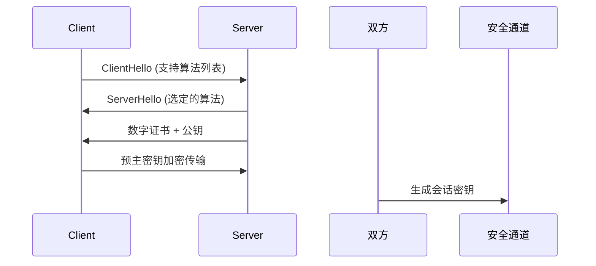

## 一、密码协议：信任传递的规则体系

### 1.1 认证协议
**挑战-响应协议**  
```python
# 典型挑战-响应流程
1. 客户端发送认证请求
2. 服务器生成随机数N（挑战）
3. 客户端用预共享密钥加密N生成响应R=H(K||N)
4. 服务器验证R的正确性
```
通过动态挑战值防止重放攻击，广泛应用于智能卡认证、双因素认证等场景。

**零知识证明**  
- **基本原理**：证明者在不透露秘密信息的前提下验证声明真实性
- **实用案例**：ZK-SNARKs在区块链隐私交易中的应用
- **实现要素**：
  - 完备性（Valid proofs verify）
  - 可靠性（False statements fail）
  - 零知识性（No extra信息泄露）

### 1.2 安全通信协议
**TLS 1.3握手流程革新**  

相比TLS 1.2的关键改进：
- 消除不安全算法（如RSA密钥交换）
- 1-RTT快速握手
- 强制前向安全性

**IPsec协议栈**
| 协议层 | AH协议 | ESP协议 |
|--------|--------|---------|
| 功能   | 完整性验证 | 加密+完整性 |
| 头部位置 | IP层 | IP层 |
| 保护范围 | 完整数据包 | 仅载荷 |

---

## 二、密钥管理：安全体系的命脉

### 2.1 PKI体系架构
**X.509证书核心字段**
```x509
Certificate:
    Version: v3
    Serial Number: 0x0a:01:...:ff
    Signature Algorithm: ecdsa-with-SHA256
    Issuer: C=CN, O=Example CA
    Validity:
        Not Before: 20240101
        Not After: 20261231
    Subject: CN=server.example.com
    Public Key: 04:9a:...:c2
    Extensions:
        Key Usage: digitalSignature
        Subject Alternative Name: DNS:*.example.com
```

### 2.2 密钥生命周期管理
**全周期保护机制**：
1. 生成：使用FIPS 140-2认证的HSM设备
2. 分发：基于量子安全的KYBER算法
3. 存储：TEE可信执行环境保护
4. 轮换：定期更换策略（如TLS会话密钥每小时更新）
5. 撤销：OCSP实时验证机制

---

## 三、安全性分析：攻防实战视角

### 3.1 密码算法评估矩阵
| 攻击类型 | AES-256 | RSA-4096 | ECC-384 |
|----------|---------|----------|---------|
| 穷举攻击 | 2^256次 | 因子分解 | ECDLP问题 |
| 侧信道防护 | 缓存屏蔽 | 时间恒定 | 随机化标量 |
| 量子威胁 | Grover算法 | Shor算法 | 同受Shor威胁 |

### 3.2 经典漏洞案例分析
**心脏出血漏洞(Heartbleed)**
- **成因**：OpenSSL 1.0.1-1.0.1f的心跳扩展未验证长度字段
- 漏洞利用：
  ```c
  // 恶意构造心跳请求
  struct heartbeat_packet {
      uint16_t payload_length; // 声明为65535
      char payload[1];          // 实际仅1字节
  }
  ```
- **后果**：服务器返回64KB内存数据（可能包含私钥等敏感信息）
- **修复方案**：
  1. 增加内存边界检查
  2. 使用带内存保护的实现（如Rust重写关键模块）
  3. 强制证书吊销与重新签发

---

## 四、前沿发展
1. **后量子密码迁移**：
   - NIST标准化进展（CRYSTALS-Kyber等算法）
   - 混合密钥交换方案（PQC + ECC）

2. **隐私增强技术**：
   - 同态加密在云计算中的应用
   - 安全多方计算协议优化

3. **硬件安全演进**：
   - TPM 2.0可信平台模块
   - Intel SGX/TDX机密计算

---

## 结语
构建安全的密码系统需要协议设计、算法实现、密钥管理、安全审计的多维度协同。随着量子计算、AI攻防等新挑战的出现，密码协议与系统安全将持续演进，在保障数字世界可信交互的道路上发挥关键作用。