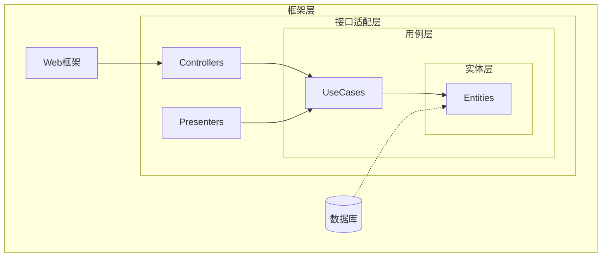
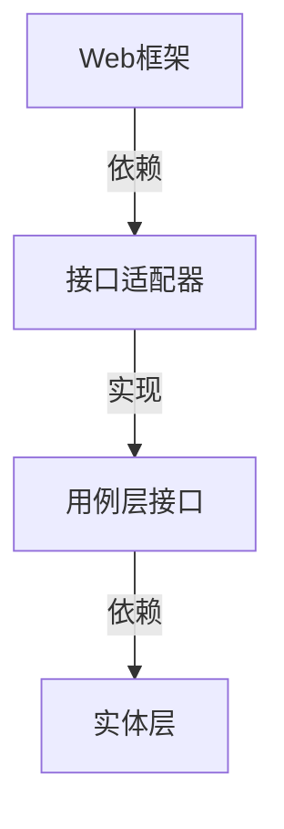

## 1. 概念与核心目标
简洁架构（Clean Architecture）是一种**以业务逻辑为核心**的软件架构设计方法论。其核心目标是：

- 建立**框架无关**的系统结构
- 保持业务逻辑的**独立性**与**可测试性**
- 实现**双向隔离**：业务核心与技术实现的隔离、数据源与展示层的隔离
- 通过分层设计强制实施**依赖规则**

## 2. 核心设计思想



### 2.1 分层结构（同心圆模型）

#### 分层说明：
1. **实体层（Entities）**
   - 包含核心业务对象与规则
   - 示例：订单实体、用户实体及其验证规则

2. **用例层（Use Cases）**
   - 实现具体业务场景的交互逻辑
   - 示例："创建订单"流程、"支付处理"流程

3. **接口适配层（Interface Adapters）**
   - 转换数据格式适配不同协议
   - 包含：控制器、网关、数据映射器

4. **框架层（Frameworks & Drivers）**
   - 技术实现细节：数据库、Web框架、UI组件

### 2.2 依赖规则
- **向内依赖原则**：外层可以依赖内层，反之禁止
- 抽象接口定义在内层，具体实现放在外层
- 数据流向：从外层到内层必须经过边界接口

## 3. 解决的关键问题
| 问题类型        | 传统架构痛点                | 简洁架构解决方案              |
|----------------|---------------------------|---------------------------|
| 代码耦合度      | 业务逻辑与技术实现深度耦合    | 通过分层强制解耦            |
| 可维护性        | 修改框架导致业务逻辑变动      | 业务核心保持技术中立        |
| 测试复杂度      | 需要启动完整环境才能测试      | 核心层可脱离框架独立测试    |
| 技术锁定        | 更换技术栈成本极高           | 通过接口适配实现灵活替换    |

## 4. 具体实现示例
### 4.1 代码结构
```python
# 实体层
class Order:
    def __init__(self, items: list, total: float):
        self._validate(items, total)
    
    def _validate(self, items, total):
        # 核心业务规则实现

# 用例层
class CreateOrderUseCase:
    def __init__(self, order_repo: OrderRepository):
        self.repo = order_repo
        
    def execute(self, items):
        order = Order(items)
        return self.repo.save(order)

# 接口适配层（实现内层定义的抽象接口）
class SQLOrderRepository:
    def save(self, order):
        # 数据库具体实现

# 框架层（FastAPI示例）
@app.post("/orders")
def create_order(items: list):
    repo = SQLOrderRepository()
    use_case = CreateOrderUseCase(repo)
    return use_case.execute(items)
```

### 4.2 依赖管理



## 5. 类似架构思想对比

|架构类型|核心差异点|适用场景|
|-|-|-|
|分层架构|水平分层 vs 同心圆分层|传统企业应用|
|六边形架构|端口-适配器模式更明确|高交互性系统|
|DDD|强调领域建模而非结构约束|复杂业务系统|
|洋葱架构|类似分层但强调领域服务层|长期演进的中大型系统|

## 6. 优势与挑战

✅ 核心优势：

- 业务核心生存周期可达10年以上
- 新功能开发效率提升40%（IBM案例研究）
- 技术迁移成本降低70%

⚠️ 实施挑战：

- 初期设计复杂度增加20%-30%
- 需要团队架构意识的根本转变
- 对简单CRUD系统可能过度设计

## 7. 最佳实践建议

- 渐进式改造：从核心模块开始实施
- 契约测试：确保接口层符合规范
- 依赖检查：使用工具强制分层规则（如ArchUnit）
- 文档驱动：维护清晰的架构边界文档
- 性能监控：关注跨层通信开销

## 8. 演进趋势

- 与微服务架构融合形成Clean Microservices
- 结合Serverless的无框架实现
- 通过WebAssembly实现核心层跨平台