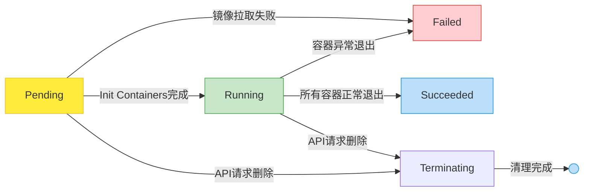

## 概念

Pod 是 Kubernetes 中最小的可部署单元，代表集群中运行的一个应用实例，由一个或多个紧密关联的容器组成。这些容器共享网络命名空间（同一 IP 和端口）、存储卷及其他资源，支持协同工作模式（如主容器与 sidecar 辅助容器配合）。通常情况下，每个 Pod 封装单个容器，但在需要耦合协作的场景（如日志收集、配置同步）中可包含多个容器。Pod 不直接管理，而是通过控制器（如 Deployment）进行复制扩展（运行多个相同 Pod 实现水平扩容），且支持 Docker 在内的多种容器运行时。

Pod 支持在同一节点上运行多个容器，这些容器共享网络命名空间（同一IP和端口）及存储卷，形成紧密协作的进程组。典型用例是主容器（如Web服务）与Sidecar容器（如日志收集、配置更新）协同工作：

- 网络共享：容器通过 localhost 直接通信，对外暴露统一IP。
- 存储共享：多个容器可读写同一持久化Volume，避免数据丢失。
- 调度特性：容器始终被共同调度到同一节点，确保低延迟协作。

⚠️ 适用场景：仅当容器需强耦合（如实时文件同步、依赖本地通信）时使用多容器Pod，否则优先采用单容器Pod+独立服务设计，以降低复杂度。

在 Kubernetes 中，Pod 作为短暂且易失的实体，通常不直接单独创建，因其缺乏自愈能力且生命周期受节点故障、资源不足或进程终止等影响而无法持久。为确保高可用性和弹性，用户通过更高级的 Controller（如 Deployment、StatefulSet、DaemonSet）管理 Pod。Controller 基于 Pod 模板动态创建并维护 Pod 集群，提供副本控制、滚动升级及自愈能力，例如在节点故障时自动将 Pod 重新调度至健康节点，从而抽象化底层运维复杂度，保障应用持续稳定运行。

### 动机

- 管理： Pod 是一个服务的多个进程的聚合单位，pod 提供这种模型能够简化应用部署管理，通过提供一个更高级别的抽象的方式。Pod 作为一个独立的部署单位，支持横向扩展和复制。共生（协同调度），命运共同体（例如被终结），协同复制，资源共享，依赖管理，pod 都会自动的为容器处理这些问题。
- 资源共享和通信： Pod 中的应用可以共享网络空间（IP 地址和端口），因此可以通过 localhost 互相发现。Pod 中的应用容器可以共享卷。持久化卷能够保证 pod 重启时使用的数据不丢失。

### 持久性

Pod 在设计支持就不是作为持久化实体的。在调度失败、节点故障、缺少资源或者节点维护的状态下都会死掉会被驱逐。

通常，用户不需要手动直接创建 Pod，而是应该使用 controller（例如 Deployments），即使是在创建单个 Pod 的情况下。Controller 可以提供集群级别的自愈功能、复制和升级管理。

### 终止

用户需要能够发起一个删除 Pod 的请求，并且知道它们何时会被终止，是否被正确的删除。用户想终止程序时发送删除 pod 的请求，在 pod 可以被强制删除前会有一个宽限期，会发送一个 TERM 请求到每个容器的主进程。一旦超时，将向主进程发送 KILL 信号并从 API server 中删除。如果 kubelet 或者 container manager 在等待进程终止的过程中重启，在重启后仍然会重试完整的宽限期。

删除宽限期默认是 30 秒。 kubectl delete 命令支持 —grace-period=<seconds> 选项，允许用户设置自己的宽限期。如果设置为 0 将强制删除 pod。在 kubectl>=1.5 版本的命令中，你必须同时使用 --force 和 --grace-period=0 来强制删除 pod。在 yaml 文件中可以通过 {{ .spec.spec.terminationGracePeriodSeconds }} 来修改此值。

**强制删除**

Pod 的强制删除是通过在集群和 etcd 中将其定义为删除状态。当执行强制删除命令时，API server 不会等待该 pod 所运行在节点上的 kubelet 确认，就会立即将该 pod 从 API server 中移除，这时就可以创建跟原 pod 同名的 pod 了。这时，在节点上的 pod 会被立即设置为 terminating 状态，不过在被强制删除之前依然有一小段优雅删除周期。强制删除对于某些 pod 具有潜在危险性，请谨慎使用。

### 特权模式

从 Kubernetes1.1 版本开始，pod 中的容器就可以开启 privileged 模式，在容器定义文件的 `SecurityContext` 下使用 `privileged` flag。这在使用 Linux 的网络操作和访问设备的能力时是很有用的。容器内进程可获得近乎等同于容器外进程的权限。在不需要修改和重新编译 kubelet 的情况下就可以使用 pod 来开发节点的网络和存储插件。

### QA

为什么不直接在一个容器中运行多个应用程序呢？

- 透明。让 pod 中的容器对基础设施可见，以便基础设施能够为这些容器提供服务，例如进程管理和资源监控。这可以为用户带来极大的便利。
- 解耦软件依赖。每个容器都可以进行版本管理，独立的编译和发布。未来 kubernetes 甚至可能支持单个容器的在线升级。
- 使用方便。用户不必运行自己的进程管理器，还要担心错误信号传播等。
- 效率。因为由基础架构提供更多的职责，所以容器可以变得更加轻量级。

为什么不支持容器的亲和性的协同调度？

这种方法可以提供容器的协同定位，能够根据容器的亲和性进行调度，但是无法实现使用 pod 带来的大部分好处，例如资源共享，IPC，保持状态一致性和简化管理等。

## Init容器

作为专用预处理容器，Init 容器在应用容器启动前顺序执行，常用于部署环境准备、依赖安装等场景，其设计特点包括：必须逐级成功运行（前一个完成后才会启动下一个）、失败时依据 Pod 的 `restartPolicy` 自动重试（Never 策略除外），且不支持就绪探针。尽管继承普通容器的资源限制、存储卷等特性，Init 容器对资源配额的处理逻辑存在差异，并在 Pod 状态中通过独立的 `status.initContainerStatuses` 字段追踪执行进度。当所有 Init 容器完成初始化后，Kubernetes 才会启动应用容器进入服务就绪状态。

Init 容器是 Kubernetes 中用于执行预初始化任务的专用容器，其核心作用在于为应用容器提供独立、安全的初始化环境。由于 Init 容器与应用容器使用分离的镜像，它们能够在不污染应用镜像的前提下，运行安装脚本、安全工具（如 sed、dig）或定制化代码，实现环境预配置、依赖检查（如等待服务就绪、延迟启动）及资源初始化（如克隆代码仓库、动态生成配置文件）。通过 Linux Namespace 的文件系统隔离，Init 容器还可安全访问敏感信息（如 Secret），而应用容器无法直接获取。此外，Init 容器严格按顺序执行且必须全部成功，天然具备阻塞机制，确保应用容器仅在所需条件（如网络依赖、资源配置）就绪后启动，从而提升应用部署的可靠性和安全性，同时实现构建与部署的角色解耦。

```
apiVersion: v1
kind: Pod
metadata:
  name: myapp-pod
  namespace: default
  labels:
    app: myapp
spec:
  containers:
  - name: myapp-container
    image: busybox
    command: ['sh', '-c', 'echo The app is running! && sleep 3600']
  initContainers:
  - name: init-myservice
    image: busybox
    command: ['sh', '-c', 'until nslookup myservice; do echo waiting for myservice; sleep 2; done;']
  - name: init-mydb
    image: busybox
    command: ['sh', '-c', 'until nslookup mydb; do echo waiting for mydb; sleep 2; done;']
```

## 安全策略(PodSecurityPolicy v1.21+弃用)

Pod 安全策略 是集群级别的资源，它能够控制 Pod 运行的行为，以及它具有访问什么的能力。 PodSecurityPolicy对象定义了一组条件，指示 Pod 必须按系统所能接受的顺序运行。它们允许管理员控制如下方面：
|控制面|字段名称|
|-|-|
|已授权容器的运行|privileged|
|为容器添加默认的一组能力|defaultAddCapabilities|
|为容器去掉某些能力|requiredDropCapabilities|
|容器能够请求添加某些能力|allowedCapabilities|
|控制卷类型的使用|volumes|
|主机网络的使用|hostNetwork|
|主机端口的使用|hostPorts|
|主机 PID namespace 的使用|hostPID|
|主机 IPC namespace 的使用|hostIPC|
|主机路径的使用|allowedHostPaths|
|容器的 SELinux 上下文|seLinux|
|用户 ID|runAsUser|
|配置允许的补充组|supplementalGroups|
|分配拥有 Pod 数据卷的 FSGroup|fsGroup|
|必须使用一个只读的 root 文件系统|readOnlyRootFilesystem|

Pod 安全策略 由设置和策略组成，它们能够控制 Pod 访问的安全特征。这些设置分为如下三类：

- 基于布尔值控制：这种类型的字段默认为最严格限制的值。
- 基于被允许的值集合控制：这种类型的字段会与这组值进行对比，以确认值被允许。
- 基于策略控制：设置项通过一种策略提供的机制来生成该值，这种机制能够确保指定的值落在被允许的这组值中。

### RunAsUser

- MustRunAs - 必须配置一个 range。使用该范围内的第一个值作为默认值。验证是否不在配置的该范围内。
- MustRunAsNonRoot - 要求提交的 Pod 具有非零 runAsUser 值，或在镜像中定义了 USER 环境变量。不提供默认值。
- RunAsAny - 没有提供默认值。允许指定任何 runAsUser 。

### SELinux

- MustRunAs - 如果没有使用预分配的值，必须配置 seLinuxOptions。默认使用 seLinuxOptions。验证 seLinuxOptions。
- RunAsAny - 没有提供默认值。允许任意指定的 seLinuxOptions ID。

### SupplementalGroups

- MustRunAs - 至少需要指定一个范围。默认使用第一个范围的最小值。验证所有范围的值。
- RunAsAny - 没有提供默认值。允许任意指定的 supplementalGroups ID。

### FSGroup

- MustRunAs - 至少需要指定一个范围。默认使用第一个范围的最小值。验证在第一个范围内的第一个 ID。
- RunAsAny - 没有提供默认值。允许任意指定的 fsGroup ID。

### 控制卷

通过设置 PSP 卷字段，能够控制具体卷类型的使用。当创建一个卷的时候，与该字段相关的已定义卷可以允许设置如下值：

- azureFile
- azureDisk
- flocker
- flexVolume
- hostPath
- emptyDir
- gcePersistentDisk
- awsElasticBlockStore
- gitRepo
- secret
- nfs
- iscsi
- glusterfs
- persistentVolumeClaim
- rbd
- cinder
- cephFS
- downwardAPI
- fc
- configMap
- vsphereVolume
- quobyte
- photonPersistentDisk
- projected
- portworxVolume
- scaleIO
- storageos
- *(allow all volumes)

对新的 PSP，推荐允许的卷的最小集合包括：configMap、downwardAPI、emptyDir、persistentVolumeClaim、secret 和 projected。

### 主机网络

- HostPorts，默认为 empty。HostPortRange 列表通过 min(包含) and max(包含) 来定义，指定了被允许的主机端口。

### 允许的主机路径

- AllowedHostPaths 是一个被允许的主机路径前缀的白名单。空值表示所有的主机路径都可以使用。

### 许可

包含 PodSecurityPolicy 的 许可控制，允许控制集群资源的创建和修改，基于这些资源在集群范围内被许可的能力。

许可使用如下的方式为 Pod 创建最终的安全上下文：

- 检索所有可用的 PSP。
- 生成在请求中没有指定的安全上下文设置的字段值。
- 基于可用的策略，验证最终的设置。

如果某个策略能够匹配上，该 Pod 就被接受。如果请求与 PSP 不匹配，则 Pod 被拒绝。

Pod 必须基于 PSP 验证每个字段。

### 创建 Pod 安全策略

下面是一个 Pod 安全策略的例子，所有字段的设置都被允许：
```
apiVersion: extensions/v1beta1
kind: PodSecurityPolicy
metadata:
  name: permissive
spec:
  seLinux:
    rule: RunAsAny
  supplementalGroups:
    rule: RunAsAny
  runAsUser:
    rule: RunAsAny
  fsGroup:
    rule: RunAsAny
  hostPorts:
  - min: 8000
    max: 8080
  volumes:
  - '*'
```
下载示例文件可以创建该策略，然后执行如下命令：
```
$ kubectl create -f ./psp.yaml
podsecuritypolicy "permissive" created
```

### 获取 Pod 安全策略列表

获取已存在策略列表，使用 kubectl get：
```
$ kubectl get psp
NAME        PRIV   CAPS  SELINUX   RUNASUSER         FSGROUP   SUPGROUP  READONLYROOTFS  VOLUMES
permissive  false  []    RunAsAny  RunAsAny          RunAsAny  RunAsAny  false           [*]
privileged  true   []    RunAsAny  RunAsAny          RunAsAny  RunAsAny  false           [*]
restricted  false  []    RunAsAny  MustRunAsNonRoot  RunAsAny  RunAsAny  false           [emptyDir secret downwardAPI configMap persistentVolumeClaim projected]
```

### 修改 Pod 安全策略

通过交互方式修改策略，使用 kubectl edit：
```
$ kubectl edit psp permissive
```

### 删除 Pod 安全策略

一旦不再需要一个策略，很容易通过 kubectl 删除它：
```
$ kubectl delete psp permissive
podsecuritypolicy "permissive" deleted
```
### 启用 Pod 安全策略

为了能够在集群中使用 Pod 安全策略，必须确保如下：

- 启用 API 类型 extensions/v1beta1/podsecuritypolicy（仅对 1.6 之前的版本）
- 启用许可控制器 PodSecurityPolicy
- 定义自己的策略


### RBAC

在 Kubernetes 1.5 或更新版本，可以使用 PodSecurityPolicy 来控制，对基于用户角色和组的已授权容器的访问。访问不同的 PodSecurityPolicy 对象，可以基于认证来控制。基于 Deployment、ReplicaSet 等创建的 Pod，限制访问 PodSecurityPolicy 对象，Controller Manager 必须基于安全 API 端口运行，并且不能够具有超级用户权限。

PodSecurityPolicy 认证使用所有可用的策略，包括创建 Pod 的用户，Pod 上指定的服务账户（service acount）。当 Pod 基于 Deployment、ReplicaSet 创建时，它是创建 Pod 的 Controller Manager，所以如果基于非安全 API 端口运行，允许所有的 PodSecurityPolicy 对象，并且不能够有效地实现细分权限。用户访问给定的 PSP 策略有效，仅当是直接部署 Pod 的情况。当直接部署 Pod 时，应用 PodSecurityPolicy 控制基于角色和组的已授权容器的访问。

## 生命周期

### 状态

Pod 的 status 字段是一个 PodStatus 对象，PodStatus 中有一个 phase 字段。

Pod 的相位（phase）是 Pod 在其生命周期中的简单宏观概述。Pod 相位的数量和含义是严格指定的。

下面是 phase 可能的值：

- 挂起（Pending）：Pod 已被 Kubernetes 系统接受，但有一个或者多个容器镜像尚未创建。等待时间包括调度 Pod 的时间和通过网络下载镜像的时间，这可能需要花点时间。
- 运行中（Running）：该 Pod 已经绑定到了一个节点上，Pod 中所有的容器都已被创建。至少有一个容器正在运行，或者正处于启动或重启状态。
- 成功（Succeeded）：Pod 中的所有容器都被成功终止，并且不会再重启。
- 失败（Failed）：Pod 中的所有容器都已终止了，并且至少有一个容器是因为失败终止。也就是说，容器以非 0 状态退出或者被系统终止。
- 未知（Unknown）：因为某些原因无法取得 Pod 的状态，通常是因为与 Pod 所在主机通信失败。

Pod 有一个 PodStatus 对象，其中包含一个 PodCondition 数组。PodCondition 数组的每个元素都有一个 type 字段和一个 status 字段。type 字段是字符串，可能的值有 PodScheduled、Ready、Initialized、Unschedulable 和 ContainersReady。status 字段是一个字符串，可能的值有 True、False 和 Unknown。



### 容器探针

探针是由 kubelet 对容器执行的定期诊断。要执行诊断，kubelet 调用由容器实现的 Handler。有三种类型的处理程序：

- ExecAction：在容器内执行指定命令。如果命令退出时返回码为 0 则认为诊断成功。
- TCPSocketAction：对指定端口上的容器的 IP 地址进行 TCP 检查。如果端口打开，则诊断被认为是成功的。
- HTTPGetAction：对指定的端口和路径上的容器的 IP 地址执行 HTTP Get 请求。如果响应的状态码大于等于 200 且小于 400，则诊断被认为是成功的。

每次探测都将获得以下三种结果之一：

- 成功：容器通过了诊断。
- 失败：容器未通过诊断。
- 未知：诊断失败，因此不会采取任何行动。

Kubelet 可以选择是否执行在容器上运行的两种探针执行和做出反应：

- livenessProbe：指示容器是否正在运行。如果存活探测失败，则 kubelet 会杀死容器，并且容器将受到其 重启策略 的影响。如果容器不提供存活探针，则默认状态为 Success。
- readinessProbe：指示容器是否准备好服务请求。如果就绪探测失败，端点控制器将从与 Pod 匹配的所有 Service 的端点中删除该 Pod 的 IP 地址。初始延迟之前的就绪状态默认为Failure。如果容器不提供就绪探针，则默认状态为 Success。

**该什么时候使用存活（liveness）和就绪（readiness）探针？**

如果容器中的进程能够在遇到问题或不健康的情况下自行崩溃，则不一定需要存活探针; kubelet 将根据 Pod 的restartPolicy 自动执行正确的操作。

如果你希望容器在探测失败时被杀死并重新启动，那么请指定一个存活探针，并指定restartPolicy 为 Always 或 OnFailure。

如果要仅在探测成功时才开始向 Pod 发送流量，请指定就绪探针。在这种情况下，就绪探针可能与存活探针相同，但是 spec 中的就绪探针的存在意味着 Pod 将在没有接收到任何流量的情况下启动，并且只有在探针探测成功后才开始接收流量。

如果你希望容器能够自行维护，你可以指定一个就绪探针，该探针检查与存活探针不同的端点。

请注意，如果你只想在 Pod 被删除时能够排除请求，则不一定需要使用就绪探针；在删除 Pod 时，Pod 会自动将自身置于未完成状态，无论就绪探针是否存在。当等待 Pod 中的容器停止时，Pod 仍处于未完成状态。

### 重启策略

PodSpec 中有一个 restartPolicy 字段，可能的值为 Always、OnFailure 和 Never。默认为 Always。 restartPolicy 适用于 Pod 中的所有容器。restartPolicy 仅指通过同一节点上的 kubelet 重新启动容器。失败的容器由 kubelet 以五分钟为上限的指数退避延迟（10 秒，20 秒，40 秒…）重新启动，并在成功执行十分钟后重置。如 Pod 文档 中所述，一旦绑定到一个节点，Pod 将永远不会重新绑定到另一个节点。

### 的生命

一般来说，Pod 不会消失，直到人为销毁他们。这可能是一个人或控制器。这个规则的唯一例外是成功或失败的 phase 超过一段时间（由 master 确定）的 Pod 将过期并被自动销毁。

有三种可用的控制器：

- 使用 Job 运行预期会终止的 Pod，例如批量计算。Job 仅适用于重启策略为 OnFailure 或 Never 的 Pod。

- 对预期不会终止的 Pod 使用 ReplicationController、ReplicaSet 和 Deployment ，例如 Web 服务器。ReplicationController 仅适用于具有 restartPolicy 为 Always 的 Pod。

- 提供特定于机器的系统服务，使用 DaemonSet 为每台机器运行一个 Pod。

所有这三种类型的控制器都包含一个 PodTemplate。建议创建适当的控制器，让它们来创建 Pod，而不是直接自己创建 Pod。这是因为单独的 Pod 在机器故障的情况下没有办法自动复原，而控制器却可以。

如果节点死亡或与集群的其余部分断开连接，则 Kubernetes 将应用一个策略将丢失节点上的所有 Pod 的 phase 设置为 Failed。

### 示例

#### 高级 liveness 探针

存活探针由 kubelet 来执行，因此所有的请求都在 kubelet 的网络命名空间中进行。

```
apiVersion: v1
kind: Pod
metadata:
  labels:
    test: liveness
  name: liveness-http
spec:
  containers:
  - args:
    - /server
    image: k8s.gcr.io/liveness
    livenessProbe:
      httpGet:
        # when "host" is not defined, "PodIP" will be used
        # host: my-host
        # when "scheme" is not defined, "HTTP" scheme will be used. Only "HTTP" and "HTTPS" are allowed
        # scheme: HTTPS
        path: /healthz
        port: 8080
        httpHeaders:
        - name: X-Custom-Header
          value: Awesome
      initialDelaySeconds: 15
      timeoutSeconds: 1
    name: liveness
```

#### 状态示例


- Pod 中只有一个容器并且正在运行。容器成功退出。
    - 记录完成事件。
    - 如果 restartPolicy 为：
        - Always：重启容器；Pod phase 仍为 Running。
        - OnFailure：Pod phase 变成 Succeeded。
        - Never：Pod phase 变成 Succeeded。
- Pod中只有一个容器并且正在运行。容器退出失败。
    - 记录失败事件。
    - 如果 restartPolicy 为：
        - Always：重启容器；Pod phase 仍为 Running。
        - OnFailure：重启容器；Pod phase 仍为 Running。
        - Never：Pod phase 变成 Failed。
- Pod 中有两个容器并且正在运行。容器 1 退出失败。
    - 记录失败事件。
    - 如果 restartPolicy 为：
        - Always：重启容器；Pod phase 仍为 Running。
        - OnFailure：重启容器；Pod phase 仍为 Running。
        - Never：不重启容器；Pod phase 仍为 Running。
    - 如果有容器 1 没有处于运行状态，并且容器 2 退出：
        - 记录失败事件。
        - 如果 restartPolicy 为：
            - Always：重启容器；Pod phase 仍为 Running。
            - OnFailure：重启容器；Pod phase 仍为 Running。
            - Never：Pod phase 变成 Failed。
- Pod 中只有一个容器并处于运行状态。容器运行时内存超出限制：
    - 容器以失败状态终止。
    - 记录 OOM 事件。
    - 如果 restartPolicy 为：
        - Always：重启容器；Pod phase 仍为 Running。
        - OnFailure：重启容器；Pod phase 仍为 Running。
        - Never: 记录失败事件；Pod phase 仍为 Failed。
- Pod 正在运行，磁盘故障：
    - 杀掉所有容器。
    - 记录适当事件。
    - Pod phase 变成 Failed。
    - 如果使用控制器来运行，Pod 将在别处重建。
- Pod 正在运行，其节点被分段。
    - 节点控制器等待直到超时。
    - 节点控制器将 Pod phase 设置为 Failed。
    - 如果是用控制器来运行，Pod 将在别处重建。

## Hook

Pod Hook（钩子）是由 Kubernetes 管理的 kubelet 发起的，当容器中的进程启动前或者容器中的进程终止之前运行，这是包含在容器的生命周期之中。可以同时为 Pod 中的所有容器都配置 hook。

Hook 的类型包括两种：

- exec：执行一段命令
- HTTP：发送 HTTP 请求。

```
apiVersion: v1
kind: Pod
metadata:
  name: lifecycle-demo
spec:
  containers:
  - name: lifecycle-demo-container
    image: nginx
    lifecycle:
      postStart:
        exec:
          command: ["/bin/sh", "-c", "echo Hello from the postStart handler> /usr/share/message"]
      preStop:
        exec:
          command: ["/usr/sbin/nginx","-s","quit"]
```

Kubernetes 在容器创建后立即发送 postStart 事件。但是，不能保证在调用容器的入口点之前调用 postStart 处理程序。postStart 处理程序相对于容器的代码异步运行，但 Kubernetes 对容器的管理将被阻止，直到 postStart 处理程序完成。在 postStart 处理程序完成之前，容器的状态不会设置为 RUNNING。

PreStop 在容器终止之前被同步阻塞调用，常用于在容器结束前优雅的释放资源。

如果 postStart 或者 preStop hook 失败，将会终止容器。

## 中断预算

### 自愿中断和非自愿中断

Pod 不会消失，直到有人（人类或控制器）将其销毁，或者当出现不可避免的硬件或系统软件错误。

我们把这些不可避免的情况称为应用的非自愿性中断。例如：

- 后端节点物理机的硬件故障
- 集群管理员错误地删除虚拟机（实例）
- 云提供商或管理程序故障使虚拟机消失
- 内核恐慌（kernel panic）
- 节点由于集群网络分区而从集群中消失
- 由于节点资源不足而将容器逐出

除资源不足的情况外，大多数用户应该都熟悉以下这些情况；它们不是特定于 Kubernetes 的。

我们称这些情况为”自愿中断“。包括由应用程序所有者发起的操作和由集群管理员发起的操作。典型的应用程序所有者操作包括：

- 删除管理该 pod 的 Deployment 或其他控制器
- 更新了 Deployment 的 pod 模板导致 pod 重启
- 直接删除 pod（意外删除）

集群管理员操作包括：

- 排空（drain）节点进行修复或升级。
- 从集群中排空节点以缩小集群。
- 从节点中移除一个 pod，以允许其他 pod 使用该节点。

这些操作可能由集群管理员直接执行，也可能由集群管理员或集群托管提供商自动执行。

询问你的集群管理员或咨询你的云提供商或发行文档，以确定是否为你的集群启用了任何自动中断源。如果没有启用，你可以跳过创建 Pod Disruption Budget（Pod 中断预算）。

### 处理中断

以下是一些减轻非自愿性中断的方法：

- 确保你的 pod 请求所需的资源。
- 如果你需要更高的可用性，请复制你的应用程序。 （了解有关运行复制的无状态和有状态应用程序的信息。）
- 为了在运行复制应用程序时获得更高的可用性，请跨机架（使用反亲和性）或跨区域（如果使用多区域集群）分布应用程序。

自愿中断的频率各不相同。在 Kubernetes 集群上，根本没有自愿的中断。但是，你的集群管理员或托管提供商可能会运行一些导致自愿中断的附加服务。例如，节点软件更新可能导致自愿更新。另外，集群（节点）自动缩放的某些实现可能会导致碎片整理和紧缩节点的自愿中断。你的集群管理员或主机提供商应该已经记录了期望的自愿中断级别（如果有的话）。

Kubernetes 提供的功能可以满足在频繁地自动中断的同时运行高可用的应用程序。我们称之为“中断预算”。

### 中断预算的工作原理

应用程序所有者可以为每个应用程序创建一个 PodDisruptionBudget 对象（PDB）。PDB 将限制在同一时间自愿中断的复制应用程序中宕机的 Pod 的数量。例如，基于定额的应用程序希望确保运行的副本数量永远不会低于仲裁所需的数量。Web 前端可能希望确保提供负载的副本的数量永远不会低于总数的某个百分比。

集群管理器和托管提供商应使用遵循 Pod Disruption Budgets 的工具，方法是调用Eviction API而不是直接删除 Pod。例如 kubectl drain 命令和 Kubernetes-on-GCE 集群升级脚本（cluster/gce/upgrade.sh）。

当集群管理员想要排空节点时，可以使用 kubectl drain 命令。该命令会试图驱逐机器上的所有 pod。驱逐请求可能会暂时被拒绝，并且该工具会定期重试所有失败的请求，直到所有的 pod 都被终止，或者直到达到配置的超时时间。

PDB 指定应用程序可以容忍的副本的数量，相对于应该有多少副本。例如，具有 spec.replicas：5 的 Deployment 在任何给定的时间都应该有 5 个 Pod。如果其 PDB 允许在某一时刻有 4 个副本，那么驱逐 API 将只允许仅有一个而不是两个 Pod 自愿中断。

使用标签选择器来指定应用程序的一组 pod，这与应用程序的控制器（Deployment、StatefulSet 等）使用的相同。

Pod 控制器的 .spec.replicas 计算“预期的”pod 数量。使用对象的 .metadata.ownerReferences 值从控制器获取。

PDB 不能阻止非自愿中断的发生，但是它们确实会影响预算。

由于应用程序的滚动升级而被删除或不可用的 Pod 确实会计入中断预算，但控制器（如 Deployment 和 StatefulSet）在进行滚动升级时不受 PDB 的限制——在应用程序更新期间的故障处理是在控制器的规格（spec）中配置（了解更新 Deployment）。

使用驱逐 API 驱逐 pod 时，pod 会被优雅地终止（请参阅 PodSpec 中的 terminationGracePeriodSeconds）。

### PDB 示例

假设集群有3个节点，`node-1` 到 `node-3`。集群中运行了一些应用，其中一个应用有3个副本，分别是 `pod-a`、`pod-b` 和 `pod-c`。另外，还有一个与它相关的不具有 PDB 的 pod，我们称为之为 `pod-x`。最初，所有 Pod 的分布如下：

|       node-1       |      node-2       |      node-3       |
| :----------------: | :---------------: | :---------------: |
| pod-a  *available* | pod-b *available* | pod-c *available* |
| pod-x  *available* |                   |                   |

所有的3个 pod 都是 Deployment 中的一部分，并且它们共同拥有一个 PDB，要求至少有3个 pod 中的2个始终处于可用状态。

例如，假设集群管理员想要重启系统，升级内核版本来修复内核中的错误。集群管理员首先使用 `kubectl drain` 命令尝试排除 `node-1`。该工具试图驱逐 `pod-a` 和 `pod-x`。这立即成功。两个 Pod 同时进入终止状态。这时的集群处于这种状态：

|  node-1 *draining*   |      node-2       |      node-3       |
| :------------------: | :---------------: | :---------------: |
| pod-a  *terminating* | pod-b *available* | pod-c *available* |
| pod-x  *terminating* |                   |                   |

Deployment 注意到其中有一个 pod 处于正在终止，因此会创建了一个 `pod-d` 来替换。由于 `node-1` 被封锁（cordon），它落在另一个节点上。同时其它控制器也创建了 `pod-y` 作为 `pod-x` 的替代品。

（注意：对于 `StatefulSet`，`pod-a` 将被称为 `pod-1`，需要在替换之前完全终止，替代它的也称为 `pod-1`，但是具有不同的 UID，可以创建。否则，示例也适用于 StatefulSet。）

当前集群的状态如下：

|  node-1 *draining*   |      node-2       |      node-3       |
| :------------------: | :---------------: | :---------------: |
| pod-a  *terminating* | pod-b *available* | pod-c *available* |
| pod-x  *terminating* | pod-d *starting*  |       pod-y       |

在某一时刻，pod 被终止，集群看起来像下面这样子：

| node-1 *drained* |      node-2       |      node-3       |
| :--------------: | :---------------: | :---------------: |
|                  | pod-b *available* | pod-c *available* |
|                  | pod-d *starting*  |       pod-y       |

此时，如果一个急躁的集群管理员试图排空（drain）`node-2` 或 `node-3`，drain 命令将被阻塞，因为对于 Deployment 只有2个可用的 pod，并且其 PDB 至少需要2个。经过一段时间，`pod-d` 变得可用。

| node-1 *drained* |      node-2       |      node-3       |
| :--------------: | :---------------: | :---------------: |
|                  | pod-b *available* | pod-c *available* |
|                  | pod-d *available* |       pod-y       |

现在，集群管理员尝试排空 `node-2`。drain 命令将尝试按照某种顺序驱逐两个 pod，假设先是 `pod-b`，然后再 `pod-d`。它将成功驱逐 `pod-b`。但是，当它试图驱逐 `pod-d` 时，将被拒绝，因为这样对 Deployment 来说将只剩下一个可用的 pod。

Deployment 将创建一个名为 `pod-e` 的 `pod-b` 的替代品。但是，集群中没有足够的资源来安排 `pod-e`。那么，drain 命令就会被阻塞。集群最终可能是这种状态：

| node-1 *drained* | node-2 *drained*  |      node-3       |    *no node*    |
| :--------------: | :---------------: | :---------------: | :-------------: |
|                  |                   | pod-c *available* | pod-e *pending* |
|                  | pod-d *available* |       pod-y       |                 |

此时，集群管理员需要向集群中添加回一个节点以继续升级操作。

您可以看到 Kubernetes 如何改变中断发生的速率，根据：

- 应用程序需要多少副本
- 正常关闭实例需要多长时间
- 启动新实例需要多长时间
- 控制器的类型
- 集群的资源能力

### 分离集群所有者和应用程序所有者角色

将集群管理者和应用程序所有者视为彼此知识有限的独立角色通常是很有用的。这种责任分离在这些情况下可能是有意义的：

- 当有许多应用程序团队共享一个 Kubernetes 集群，并且有自然的专业角色
- 使用第三方工具或服务来自动化集群管理

Pod Disruption Budget（Pod 中断预算） 通过在角色之间提供接口来支持这种角色分离。

如果您的组织中没有这样的职责分离，则可能不需要使用 Pod 中断预算。

### 如何在集群上执行中断操作

如果您是集群管理员，要对集群的所有节点执行中断操作，例如节点或系统软件升级，则可以使用以下选择：

- 在升级期间接受停机时间。
- 故障转移到另一个完整的副本集群。
  - 没有停机时间，但是对于重复的节点和人工协调成本可能是昂贵的。
- 编写可容忍中断的应用程序和使用 PDB。
  - 没有停机时间。
  - 最小的资源重复。
  - 允许更多的集群管理自动化。
  - 编写可容忍中断的应用程序是很棘手的，但对于可容忍自愿中断，和支持自动调整以容忍非自愿中断，两者在工作上有大量的重叠。