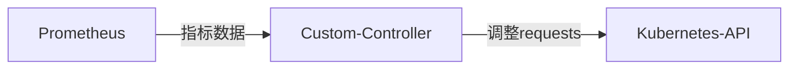
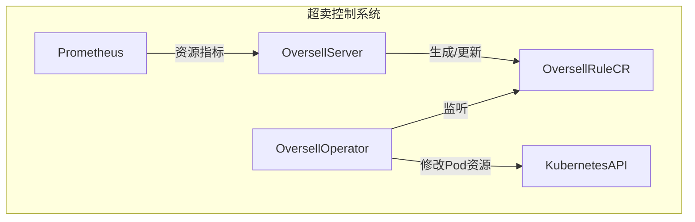
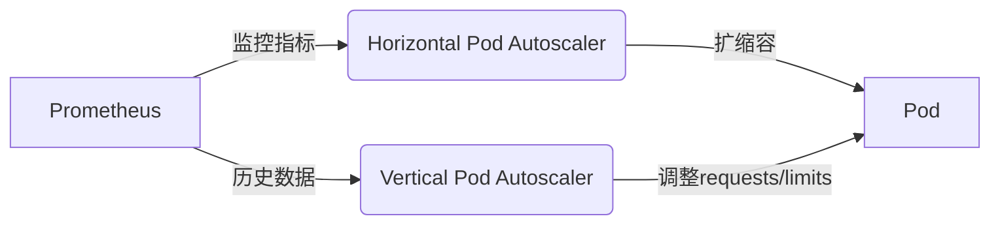

# 背景

## What

**资源超卖（Oversubscription）** 是指在计算资源（如CPU、内存）的分配过程中，系统承诺给用户或工作负载的资源总量 **超过实际可用的物理资源**。这一概念类似于航空公司的机票超售：飞机座位是有限的，但通过统计分析和历史数据预测，航空公司可以卖出略多于实际容量的机票，因为通常会有部分乘客改签或取消行程。  

在Kubernetes（k8s）中，超卖通常表现为：  
- **资源请求（Requests）总和 < 节点实际资源**  
  例如：一个节点有16核CPU，但所有Pod的CPU请求总和为20核。  
- **资源限制（Limits）总和 >> 节点实际资源**  
  例如：节点内存为64GB，但所有Pod的内存限制总和达到80GB。  

**为什么能实现超卖？**  
1. **资源使用具有波动性**  
   - 大多数应用不会始终满负荷运行（如Web服务在夜间流量低谷时CPU利用率可能低于10%）。  
2. **时间片复用（CPU）**  
   - CPU是时分复用资源，超卖的Pod通过分时共享物理核心。  
3. **内存超卖的投机性**  
   - 依赖“并非所有Pod会同时满负荷使用内存”的假设，但风险较高（可能触发OOM Kill）。  

**超卖 vs 资源过度分配（Overcommitment）**  
- **超卖** 是主动行为，目的是提高资源利用率，通常伴随监控和兜底机制。  
- **过度分配** 可能是无意识的配置错误，容易导致系统不稳定。  

```yaml
# 一个超卖CPU的Pod配置示例：
resources:
  requests:
    cpu: "0.5"  # 调度器按此值分配
  limits:
    cpu: "2"     # 实际可突发使用2核（如果节点有空闲）
```  

## Why

**1. 提升集群资源利用率**  
- **现实问题**：大多数Kubernetes集群的**平均资源利用率不足50%**（尤其是CPU），大量资源因“预留”而闲置。  
- **超卖的作用**：  
  - 允许更多Pod运行在相同节点上，充分利用资源空闲时段。  
  - 例如：一个16核的节点，若所有Pod的`requests`总和为10核，超卖后实际运行20核的负载（利用时间片复用）。  

**2. 降低成本**  
- **云环境成本优化**：减少为“峰值负载”预留的节点数量，直接降低云厂商计费（如AWS EC2实例费用）。  
- **裸金属服务器场景**：通过超卖推迟硬件扩容，降低CAPEX（资本支出）。  

**3. 支持弹性业务需求**  
- **突发流量处理**：互联网服务的流量具有潮汐特征（如电商大促），超卖允许Pod临时突破`requests`限制，快速响应请求。  
- **批处理任务**：AI训练、日志分析等短时高负载任务，可通过超卖“见缝插针”式调度，避免排队等待。  

**4. 开发/测试环境效率**  
- **低优先级负载容忍超卖**：开发环境的Pod通常不需要严格SLA，超卖可让单节点运行更多测试容器，加速CI/CD流程。  

**背后的经济学原理**  
超卖本质是**通过风险交换效率**，其可行性依赖两个统计规律：  
1. **负载不重合性**：不同业务的峰值时间错开（如白天在线服务、夜间批处理任务）。  
2. **局部性原理**：多数应用的实际资源使用量长期低于其`requests`（如某服务声明需要4核，但实际平均使用1核）。  

**典型案例**  
- **某视频网站**：通过CPU超卖将直播转码任务的集群成本降低40%，仅在大规模直播事件时短暂启用备用节点。  
- **机器学习平台**：超卖GPU节点的显存，允许多个推理任务共享同一张GPU卡（需显存隔离工具配合）。  

## 风险与挑战

Kubernetes资源超卖虽然能提高资源利用率，但同时也引入了潜在风险。如果不加以控制，可能导致集群不稳定、应用性能下降，甚至服务中断。以下是超卖的主要风险和应对思路：  

---

**1. 资源竞争导致的性能下降**  

**（1）CPU Throttling（CPU限流）**  
- **问题**：当多个Pod竞争CPU时，Kubernetes会对超出`requests`的Pod进行**CPU限流**，导致应用响应变慢。  
- **表现**：Pod的`cpu_throttling`指标升高，请求延迟增加。  
- **解决方案**：  
  - 使用`Horizontal Pod Autoscaler (HPA)`动态调整副本数，减少单Pod负载。  
  - 监控`CPU Throttling`指标，优化`requests`和`limits`的比值（如`requests: 1, limits: 2`）。  

**（2）内存争抢（OOM Kill）**  
- **问题**：内存超卖后，如果多个Pod同时占用高内存，Kubernetes的`kubelet`会触发**OOM Killer**，强制终止Pod。  
- **表现**：Pod被意外终止，日志显示`OOMKilled`。  
- **解决方案**：  
  - **避免超卖关键业务Pod**，仅对低优先级任务（如批处理Job）超卖内存。  
  - 设置合理的`limits`，并监控`memory.usage`，接近阈值时告警。  

---
**2. 节点资源耗尽（Noisy Neighbor Problem）** 

**（1）磁盘I/O、网络带宽争抢**  
- **问题**：超卖通常只关注CPU/内存，但**磁盘I/O、网络带宽**也可能成为瓶颈。  
  - 例如：某个Pod疯狂写日志，导致节点磁盘IOPS饱和，影响其他Pod。  
- **解决方案**：  
  - 使用`ResourceQuota`限制每个Namespace的存储/网络资源。  
  - 对高I/O负载的Pod使用`Local SSD`或独立网络QoS策略。  

**（2）节点压力驱逐（Node Pressure Eviction）**  
- **问题**：当节点资源（内存、磁盘）耗尽时，`kubelet`会按优先级驱逐Pod，可能导致服务中断。  
- **解决方案**：  
  - 配置`kubelet`的`--eviction-hard`参数，提前触发驱逐（如`memory.available<10%`时）。  
  - 使用`Pod PriorityClass`，确保关键服务不被优先驱逐。  

---

**3. 监控与运维复杂度增加**  
**（1）资源使用难以预测**  
- **问题**：超卖后，实际资源使用量可能远超`requests`，导致容量规划困难。  
- **解决方案**：  
  - 使用`Prometheus + Grafana`监控实际资源利用率，建立超卖比例模型（如`超卖率=Σlimits/节点容量`）。  
  - 定期进行**压力测试**，模拟峰值负载下的集群行为。  

**（2）故障排查难度上升**  
- **问题**：超卖环境下，问题可能由资源竞争引起，而非应用本身。  
- **解决方案**：  
  - 记录`kubelet`日志，关注`OOMKilled`和`CPUThrottling`事件。  
  - 使用`kubectl describe node`查看节点资源分配情况。  

---

**4. 不适合超卖的场景**  
| **场景**               | **风险**                          | **建议**                     |
|-----------------------|----------------------------------|-----------------------------|
| 金融交易类服务          | 延迟敏感，OOM可能导致交易失败       | 禁用超卖，使用`Guaranteed` QoS |
| 数据库（MySQL/Redis）   | 内存竞争可能导致缓存失效或查询超时   | 独立节点部署，不超卖内存        |
| 实时音视频处理          | CPU限流会导致卡顿、音画不同步       | 预留专用资源                  |

---

**总结：如何安全超卖？**  
1. **分层超卖**：核心业务不超卖，非核心业务适度超卖。  
2. **动态调整**：结合`VPA/HPA`自动优化资源分配。  
3. **严格监控**：关注`OOM Kill`、`CPU Throttling`、节点压力指标。  
4. **渐进式验证**：先在`Dev/Test`环境测试，再逐步推广到生产。  

# 实现原理

## CPU虚拟化与隔离

### Linux Cgroups（控制组）
Kubernetes通过`cgroups`（特别是`cpu`和`cpuacct`子系统）限制容器的CPU使用：  
- **`cpu.cfs_quota_us` & `cpu.cfs_period_us`**  
  - 用于实现CPU时间片分配（CFS调度器）。  
  - 例如：设置`cpu.cfs_quota_us=100000`（100ms）和`cpu.cfs_period_us=100000`（100ms），表示容器最多使用**1个CPU核心**。  
  - 如果`quota=200000`，则允许使用**2个CPU核心**（即`limits.cpu: "2"`）。  

- **`cpu.shares`**  
  - 用于设置CPU权重（影响`requests.cpu`）。  
  - 默认值：`1024`（相当于1个CPU核心的权重）。  
  - 例如：Pod A的`requests.cpu: 2` → `cpu.shares=2048`；Pod B的`requests.cpu: 1` → `cpu.shares=1024`。  
  - **当CPU资源紧张时**，Pod A获得的CPU时间是Pod B的2倍。  

### CPU Throttling（限流）
- 当容器尝试使用超过`limits.cpu`时，内核会**限制其CPU时间片**，导致性能下降（`throttled_cpu_time`增加）。  
- **查看容器的CPU限流情况**：  
  ```bash
  cat /sys/fs/cgroup/cpu/kubepods/pod-<id>/cpu.stat
  ```
  输出示例：  
  ```
  nr_periods 1000  
  nr_throttled 200  
  throttled_time 50000000  # 被限流的时间（纳秒）
  ```

### 多核与超线程（SMT）的影响
- **物理核心（Core） vs 逻辑核心（vCPU）**：  
  - 超线程（Hyper-Threading）会让1个物理核心表现为2个逻辑核心（vCPU）。  
  - Kubernetes的`limits.cpu`对应的是**逻辑核心**，因此超卖时需注意物理核心的争抢。  
- **CPU亲和性（Affinity）**：  
  - 可通过`cpuAffinity`将Pod绑定到特定核心，减少上下文切换开销（但对超卖灵活性有影响）。  

---

## 内存虚拟化与隔离

### Cgroups内存控制
Kubernetes通过`memory`子系统限制容器内存：  
- **`memory.limit_in_bytes`**  
  - 对应`limits.memory`，例如设置`4Gi` → `memory.limit_in_bytes=4294967296`。  
  - 当容器内存使用超过该值，会触发**OOM Kill**（除非配置了`swap`，但Kubernetes默认禁用）。  

- **`memory.soft_limit_in_bytes`**  
  - 对应`requests.memory`，内核会尽量保障该值，但不强制限制。  

- **`memory.oom_control`**  
  - 可禁用OOM Killer（不推荐，可能导致节点不稳定）。  

### 内存超卖的风险

- **OOM Kill机制**：  
  - 当节点内存不足时，内核根据`oom_score`（受QoS影响）选择牺牲者。  
  - **查看Pod的OOM分数**：  
    ```bash
    cat /proc/<pid>/oom_score
    ```
    - `BestEffort` Pod的分数通常最高（最先被杀）。  
- **Swap的争议**：  
  - Kubernetes默认**禁用swap**，因为磁盘交换会大幅降低性能。  
  - 如果启用swap，超卖内存的Pod可能不会立即OOM Kill，但会导致严重性能下降。  

### Kernel内存与透明大页（THP）

- **Kernel内存**：  
  - 包括Slab、Page Tables等，不计入`limits.memory`，但可能影响节点稳定性。  
- **透明大页（Transparent Huge Pages, THP）**：  
  - 大内存页（2MB/1GB）可提高性能，但可能导致内存碎片化。  
  - 建议在`kubelet`中禁用THP：  
    ```bash
    --feature-gates=DynamicKubeletConfig=true --kube-reserved="memory=1Gi" --kernel-memcg-notify=true
    ```

## 资源请求（Requests）与限制（Limits）

### Requests（请求）
- **定义**：Pod向Kubernetes声明的**最小资源需求**，调度器（Scheduler）依据该值决定Pod应该运行在哪个节点上。  
- **示例**：  
  ```yaml
  resources:
    requests:
      cpu: "1"    # 申请1核CPU
      memory: "2Gi" # 申请2GB内存
  ```
- **作用**：
  - **调度依据**：如果一个节点的剩余可分配CPU < 1核，则Pod不会被调度到该节点。  
  - **资源预留**：`kubelet`会为Pod预留这部分资源，即使Pod未完全使用。  

### Limits（限制）
- **定义**：Pod可以使用的**最大资源上限**，超过该值会被限制（CPU）或终止（内存）。  
- **示例**：  
  ```yaml
  resources:
    limits:
      cpu: "2"    # 最多使用2核CPU
      memory: "4Gi" # 最多使用4GB内存
  ```
- **作用**：
  - **CPU限流（Throttling）**：如果Pod尝试使用超过`limits.cpu`，Linux内核的`CFS`（完全公平调度器）会限制其CPU时间片。  
  - **OOM Kill**：如果Pod的内存使用超过`limits.memory`，`kubelet`会强制终止该Pod（`OOMKilled`）。  

### Requests vs Limits 关系 
| **场景**               | **表现**                                                                 |
|-----------------------|-------------------------------------------------------------------------|
| `requests < limits`   | **可超卖**：Pod可以临时使用超出`requests`的资源（超卖的基础）。           |
| `requests == limits`  | **不可超卖**：Pod只能使用固定量的资源（`Guaranteed` QoS，适合关键业务）。 |
| 未设置`requests/limits` | **最低优先级**：Pod可能被随意调度，并面临资源竞争（`BestEffort` QoS）。  |

---

## QoS（服务质量）

Kubernetes根据`requests`和`limits`的配置，将Pod分为**3种QoS等级**，直接影响资源竞争时的优先级：  

### Guaranteed（最高优先级）
- **条件**：所有容器的`requests == limits`（CPU和内存均需设置）。  
- **特点**：
  - 资源完全保障，不会被超卖影响。  
  - **最后被OOM Kill**，适合数据库、核心服务。  

### Burstable（中等优先级）
- **条件**：至少一个容器设置了`requests`，但`requests < limits`。  
- **特点**：
  - 可以超卖，但受`limits`约束。  
  - **OOM Kill优先级低于`BestEffort`**，适合普通业务Pod。  

### BestEffort（最低优先级）
- **条件**：未设置任何`requests`和`limits`。  
- **特点**：
  - 资源无保障，完全依赖节点剩余资源。  
  - **最先被OOM Kill**，适合临时任务、测试环境。  

### QoS优先级总结
```
OOM Kill顺序：BestEffort → Burstable → Guaranteed
```

---

## 调度器如何基于资源请求分配Pod？

Kubernetes调度器（`kube-scheduler`）在调度Pod时，**仅考虑`requests`**，而`limits`不影响调度决策。流程如下：  

1. **筛选（Filtering）**  
   - 检查节点剩余可分配资源（`Allocatable`）是否 ≥ Pod的`requests`。  
   - 排除不满足条件的节点（如CPU不足、内存不足）。  

2. **评分（Scoring）**  
   - 对剩余节点打分（如选择资源剩余最多的节点，避免热点）。  

3. **绑定（Binding）**  
   - 将Pod绑定到最佳节点，`kubelet`负责后续资源分配。  

**关键点**  
- **超卖的本质**：多个Pod的`requests`总和可以超过节点实际资源，只要它们的`limits`总和也允许。  
- **调度器不检查`limits`**：即使`limits`总和远超节点容量，只要`requests`满足，Pod仍会被调度。  

---

**示例：超卖调度场景**  
假设一个节点有 **4核CPU / 8GB内存**：  

| **Pod** | **CPU Requests** | **CPU Limits** | **内存 Requests** | **内存 Limits** |
|--------|------------------|----------------|-------------------|-----------------|
| Pod A  | 1核              | 2核            | 2GB               | 4GB             |
| Pod B  | 1核              | 2核            | 2GB               | 4GB             |
| Pod C  | 1核              | 2核            | 2GB               | 4GB             |

- **调度结果**：  
  - `requests`总和 = 3核CPU / 6GB内存 ≤ 节点容量（4核/8GB）→ **允许调度**。  
  - `limits`总和 = 6核CPU / 12GB内存 > 节点容量 → **实际运行依赖资源争抢**。  

# 实现方案

## 静态超卖 
**核心思想**：通过手动设置Pod的`requests`和`limits`差值，允许其临时占用超额资源。  

**CPU静态超卖**

- **适用场景**：突发流量、批处理任务等短期高负载需求。  
- **配置示例**：  
  ```yaml
  resources:
    requests:
      cpu: "1"      # 调度器按1核分配
    limits:
      cpu: "4"      # 实际允许使用4核（超卖3核）
  ```
- **效果**：  
  - 调度器保证至少有1核可用，但Pod可突发使用至4核（若节点有空闲资源）。  
  - 若多个Pod同时爆发，则触发CPU Throttling。  

**内存静态超卖**

- **适用场景**：内存使用波动大的服务（如缓存服务）。  
- **配置示例**：  
  ```yaml
  resources:
    requests:
      memory: "1Gi"  # 调度器预留1GB
    limits:
      memory: "3Gi"  # 允许使用3GB（超卖2GB）
  ```
- **风险**：  
  - 若多个Pod同时占用高内存，可能触发OOM Kill。  

**静态超卖的优缺点**  
| **优点**                     | **缺点**                          |
|-----------------------------|----------------------------------|
| 配置简单，无需额外组件          | 超卖比例固定，无法适应动态负载      |
| 适合已知规律的负载              | 内存超卖风险较高                  |

---

## 动态超卖 

**核心思想**：通过自动化工具实时调整`requests`，基于实际负载动态控制超卖比例。  

### Vertical Pod Autoscaler（VPA）

- **作用**：自动调整Pod的`requests`和`limits`，避免资源浪费。  
- **配置示例**：  
  ```yaml
  apiVersion: autoscaling.k8s.io/v1
  kind: VerticalPodAutoscaler
  metadata:
    name: my-app-vpa
  spec:
    targetRef:
      apiVersion: "apps/v1"
      kind: Deployment
      name: my-app
    updatePolicy:
      updateMode: "Auto"  # 自动更新Pod资源
  ```
- **动态超卖逻辑**：  
  - VPA监控Pod的历史资源使用量，降低`requests`（如从2核→1核），腾出资源供其他Pod超卖使用。  
  - **注意**：VPA的`Auto`模式会重建Pod，可能引发短暂服务中断。  

### 基于Prometheus的自适应超卖

**架构**：  


**实现步骤**：  
  1. 使用Prometheus采集节点和Pod的实时资源使用率（如`container_cpu_usage_seconds_total`）。  
  2. 自定义控制器计算安全超卖比例（例如：`超卖系数 = 当前空闲资源 / 总资源`）。  
  3. 动态修改Pod的`requests`（需配合`kubectl patch`或API调用）。  

**动态超卖的优缺点**
| **优点**                     | **缺点**                          |
|-----------------------------|----------------------------------|
| 适应负载变化，资源利用率最大化  | 实现复杂度高，需维护监控和控制器    |
| 降低OOM风险（通过动态调整）    | VPA的`Auto`模式可能导致Pod重建     |


## 节点级超卖

**核心思想**：在节点层面全局控制资源分配，而非单个Pod。  

### kubelet资源预留参数

- **`--system-reserved`**：为系统进程（如sshd、docker）预留资源。  
- **`--kube-reserved`**：为Kubernetes组件（如kubelet、CNI插件）预留资源。  
- **`--eviction-hard`**：设置资源驱逐阈值（如内存不足时触发Pod驱逐）。  

**示例**：允许节点超卖CPU 20%  
```bash
kubelet \
  --system-reserved=cpu=1,memory=1Gi \
  --kube-reserved=cpu=0.5,memory=512Mi \
  --eviction-hard=memory.available<500Mi
```

### 节点资源分配策略

- **`--cpu-manager-policy=static`**：  
  - 将CPU核心独占分配给关键Pod（如Guaranteed QoS的Pod），其余核心用于超卖。  
- **`--memory-manager-policy=None`**：  
  - 默认策略，允许内存超卖（若需严格隔离，可切换为`Static`或`Dynamic`）。  

### 节点级超卖的优缺点
| **优点**                     | **缺点**                          |
|-----------------------------|----------------------------------|
| 全局控制，避免单个Pod配置遗漏  | 调整需重启kubelet，影响节点可用性  |
| 适合混合部署（关键+非关键业务） | 内存超卖仍需谨慎                  |

## 超卖控制器

为了实现动态资源超卖，我们可以设计一个超卖控制系统，包含以下核心组件：

- 超卖Server（Oversell Server）：负责计算超卖策略，生成/更新OversellRule CR。
- 超卖Operator（Oversell Operator）：监听OversellRule CR，动态调整Pod的requests/limits。
- 监控系统（Prometheus + Metrics Server）：提供实时资源利用率数据。



# 超卖的关键技术考量

## 资源类型差异：CPU vs 内存超卖

### CPU超卖：时间片复用  

- **技术原理**：  
  - CPU是**时分复用**资源，通过Linux CFS调度器分配时间片。  
  - 超卖后，多个Pod分时共享物理核心（如10个Pod的`limits.cpu`总和为20核，但节点只有16核）。  
- **优势**：  
  - 即使超卖，Pod仅会因Throttling导致**性能下降**，通常不会崩溃。  
- **风险控制**：  
  - 监控`CPU Throttling`比例（超过5%需告警）。  
  - 为关键Pod设置`cpuAffinity`，减少上下文切换开销。  

**指标参考**：  
```promql
# 查询容器的CPU限流时间占比
sum(rate(container_cpu_cfs_throttled_seconds_total{container!=""}[5m])) by (pod)
/
sum(rate(container_cpu_usage_seconds_total{container!=""}[5m])) by (pod)
```

### 内存超卖：OOM Kill风险 

- **技术原理**：  
  - 内存是**独占式资源**，超卖依赖“并非所有Pod同时满负荷”的假设。  
  - 一旦节点内存耗尽，内核根据`oom_score`强制终止Pod（`OOMKilled`）。  
- **优势**：  
  - 可显著提高内存利用率（尤其对稀疏使用的服务）。  
- **风险控制**：  
  - **避免超卖关键Pod**（如数据库），仅对无状态服务超卖。  
  - 设置`limits.memory` ≤ 节点可用内存的70%（预留缓冲）。  

**指标参考**：  
```promql
# 查询OOM Kill事件
kube_pod_container_status_last_terminated_reason{reason="OOMKilled"}
```

**CPU与内存超卖对比**  
| **维度**         | **CPU超卖**                | **内存超卖**                |
|------------------|---------------------------|---------------------------|
| 隔离机制          | 时间片分时共享              | 硬性上限（OOM Kill）        |
| 超卖安全性        | 高（仅限流）               | 低（可能崩溃）             |
| 适合场景          | 计算密集型、批处理任务       | 内存使用波动大的无状态服务    |

---

## 监控与告警策略

### 核心监控指标

| **指标**                          | **说明**                              | **超卖健康阈值**          |
|-----------------------------------|---------------------------------------|--------------------------|
| `node_memory_MemAvailable_bytes`  | 节点可用内存量                         | <20%总内存时告警          |
| `container_cpu_cfs_throttled_seconds_total` | CPU限流时间                          | >5%时告警                |
| `container_memory_working_set_bytes`        | Pod内存使用量（常驻集）               | 接近`limits.memory`时告警 |
| `kube_pod_status_phase{phase="Failed"}`    | 因OOM Kill失败的Pod                  | 任意出现即告警            |

**Grafana看板示例**：  
- **CPU超卖看板**：展示各节点的`CPU Allocatable` vs `CPU Requests` vs `CPU Usage`。  
- **内存超卖看板**：监控`Memory Limits`总和与节点物理内存的比例。  

### 告警规则示例（Prometheus）

```yaml
# 内存超卖告警：节点可用内存不足
- alert: NodeMemoryUnderPressure
  expr: node_memory_MemAvailable_bytes / node_memory_MemTotal_bytes < 0.2
  for: 5m
  labels:
    severity: warning
  annotations:
    summary: "{{ $labels.instance }} 可用内存低于20%"

# CPU限流告警
- alert: HighCPUThrottling
  expr: rate(container_cpu_cfs_throttled_seconds_total[5m]) / rate(container_cpu_usage_seconds_total[5m]) > 0.05
  for: 10m
  labels:
    severity: warning
```

---

## 优先级与抢占机制

### Pod PriorityClass

通过定义优先级，确保关键业务在资源竞争时优先存活：  

```yaml
apiVersion: scheduling.k8s.io/v1
kind: PriorityClass
metadata:
  name: high-priority
value: 1000000  # 优先级数值（越高越优先）
preemptionPolicy: Never  # 是否允许抢占其他Pod
```

**使用场景**：  
- **关键业务**：设置为`high-priority`，避免被OOM Kill或驱逐。  
- **批处理任务**：设置为`low-priority`，允许超卖且可被抢占。  

### 调度抢占（Preemption） 

- **触发条件**：  
  当高优先级Pod因资源不足无法调度时，Kubernetes会尝试**驱逐低优先级Pod**腾出资源。  
- **限制**：  
  - 仅驱逐`Burstable`/`BestEffort` Pod，不驱逐`Guaranteed` Pod。  
  - 需配合`PodDisruptionBudget`（PDB）防止大规模中断。  

**示例**：  
```yaml
apiVersion: policy/v1
kind: PodDisruptionBudget
metadata:
  name: zk-pdb
spec:
  minAvailable: 2  # 保证至少2个Pod可用
  selector:
    matchLabels:
      app: zookeeper
```

---

## 超卖场景下的优化技巧

### CPU绑核（CPU Pinning）
- **问题**：超卖可能导致CPU缓存频繁失效，降低性能。  
- **方案**：对延迟敏感型Pod绑定特定核心：  
  ```yaml
  resources:
    limits:
      cpu: "2"
  affinity:
    nodeAffinity: {...}
    podAntiAffinity: {...}
  ```

### 内存大页（HugePages） 
- **问题**：常规4KB内存页在超卖时可能引发TLB抖动。  
- **方案**：为数据库等应用分配大页内存：  
  ```yaml
  resources:
    limits:
      memory: "2Gi"
      hugepages-2Mi: "1Gi"
  ```

### cgroup v2增强隔离
- **特性**：  
  - **CPU权重**：替代`cpu.shares`，更精确控制资源分配。  
  - **内存QoS**：限制内存回收优先级，减少OOM概率。  
- **启用方式**：  
  ```bash
  kubelet --cgroup-driver=systemd --cgroups-per-qos=true --enforce-node-allocatable=pods
  ```


# 超卖的最佳实践

资源超卖是一把双刃剑，用得好可以显著提升集群效率，用不好则可能导致稳定性问题。本章将结合生产经验，总结**适合超卖的场景**、**避免超卖陷阱的方法**，以及**混合部署策略**，帮助你在安全边界内最大化资源利用率。  

---

## 适合超卖的场景

### 非关键业务

| **业务类型**       | **超卖建议**                                                                 |
|-------------------|-----------------------------------------------------------------------------|
| **开发/测试环境**   | 允许CPU/内存超卖，即使发生OOM Kill影响也有限                                  |
| **CI/CD流水线**    | 构建任务可超卖CPU，加速任务完成（配合`BestEffort` QoS）                      |
| **批处理作业**      | 日志分析、数据清洗等短时任务，适合动态超卖（突发资源需求后释放）                |

**配置示例（低优先级批处理Job）**：  
```yaml
apiVersion: batch/v1
kind: Job
metadata:
  name: data-processor
spec:
  template:
    spec:
      priorityClassName: low-priority  # 设置为低优先级
      containers:
      - name: processor
        resources:
          requests:
            cpu: "0.5"
            memory: "512Mi"
          limits:
            cpu: "2"
            memory: "2Gi"
```

### 弹性业务负载

| **业务类型**       | **超卖策略**                                                                |
|-------------------|-----------------------------------------------------------------------------|
| **Web服务**        | 根据流量规律超卖CPU（日间高峰时突发，夜间自动缩容）                           |
| **缓存服务**       | 超卖内存（如Redis实例内存`limits`设为物理内存的120%，依赖监控及时扩容）         |
| **消息队列消费者**  | 消费队列积压时临时超卖CPU，快速消费后释放资源                                  |

**流量自适应超卖架构**：  


---

## 避免超卖陷阱的硬性规则

### 内存超卖的禁区
- **禁止超卖的场景**：  
  - 数据库（MySQL/PostgreSQL等）—— OOM可能导致数据损坏。  
  - 有状态服务（如Etcd、ZooKeeper）—— 内存不足破坏集群一致性。  
  - 实时音视频处理—— 内存抖动引发卡顿或中断。  

- **安全替代方案**：  
  ```yaml
  # 数据库Pod的配置示例（禁止超卖）
  resources:
    requests:
      memory: "8Gi"
    limits:
      memory: "8Gi"  # requests == limits → Guaranteed QoS
  ```

### CPU超卖的缓冲策略
- **设置Throttling告警阈值**：  
  ```promql
  # 当CPU限流时间占比超过10%时告警
  sum(rate(container_cpu_cfs_throttled_seconds_total[5m])) by (pod) / sum(rate(container_cpu_usage_seconds_total[5m])) by (pod) > 0.1
  ```
- **关键Pod的CPU绑定**：  
  ```yaml
  affinity:
    nodeAffinity: {...}
  resources:
    limits:
      cpu: "2"
    requests:
      cpu: "2"
  ```

### 全局资源配额（ResourceQuota）

通过`ResourceQuota`限制Namespace级别的超卖总量，避免单个团队过度占用资源：  
```yaml
apiVersion: v1
kind: ResourceQuota
metadata:
  name: oversell-quota
spec:
  hard:
    requests.cpu: "100"     # 所有Pod的requests总和不超过100核
    limits.cpu: "200"       # 所有Pod的limits总和不超过200核（超卖比例2:1）
    requests.memory: 200Gi
    limits.memory: 300Gi    # 内存超卖比例1.5:1
```

---

## 混合部署策略

### 节点分组管理 
| **节点池**          | **超卖策略**                              | **标签选择器示例**              |
|--------------------|-----------------------------------------|-------------------------------|
| **critical-nodes** | 禁止超卖（Guaranteed QoS专用）            | `node-role.kubernetes.io/critical=true` |
| **oversell-nodes** | 允许CPU/内存超卖（运行非关键业务）          | `node-role.kubernetes.io/oversell=true` |

**调度示例**：  
```yaml
apiVersion: apps/v1
kind: Deployment
metadata:
  name: nginx
spec:
  template:
    spec:
      nodeSelector:
        node-role.kubernetes.io/oversell: "true"  # 指定调度到超卖节点
```
### 优先级与驱逐协同
1. **关键业务**：  
   - 设置`priorityClassName: system-cluster-critical`（Kubernetes内置最高优先级）。  
   - 配置`podAntiAffinity`避免与其他高负载Pod同节点。  
2. **低优先级任务**：  
   - 允许被驱逐（`priorityClassName: low-priority`）。  
   - 设置`restartPolicy: OnFailure`应对OOM Kill。  

**完整示例**：  
```yaml
apiVersion: apps/v1
kind: Deployment
metadata:
  name: web-service
spec:
  template:
    spec:
      priorityClassName: high-priority
      affinity:
        podAntiAffinity:
          requiredDuringSchedulingIgnoredDuringExecution:
          - labelSelector:
              matchExpressions:
              - key: app
                operator: In
                values: ["redis"]
            topologyKey: kubernetes.io/hostname
      containers:
      - name: nginx
        resources:
          requests:
            cpu: "2"
            memory: "4Gi"
          limits:
            cpu: "2"
            memory: "4Gi"
```

---

## 超卖实施的渐进式验证

### 四阶段上线流程
1. **观察期**（1周）：  
   - 采集现有业务的**真实资源使用曲线**（尤其关注波谷时段）。  
2. **小规模测试**（2周）：  
   - 在`dev`命名空间对非关键Pod启用超卖，监控Throttling/OOM事件。  
3. **滚动推广**（1个月）：  
   - 按业务优先级分批调整`requests/limits`，优先处理批处理任务。  
4. **全局优化**：  
   - 结合VPA动态调整超卖比例，定期审查监控数据。  

**验收指标**：  
- CPU平均利用率从30%提升至60%+，且Throttling率<5%。  
- 内存OOM Kill事件每周≤1次（仅发生在低优先级Pod）。  

---

## 总结：超卖的安全边界

- ✅ **可以做**：  
  - 对无状态、可中断的业务超卖CPU。  
  - 在监控完备的情况下超卖内存（预留20%缓冲）。  
- ❌ **不要做**：  
  - 超卖数据库、有状态服务的内存。  
  - 在未设置PriorityClass和ResourceQuota时全局超卖。  

